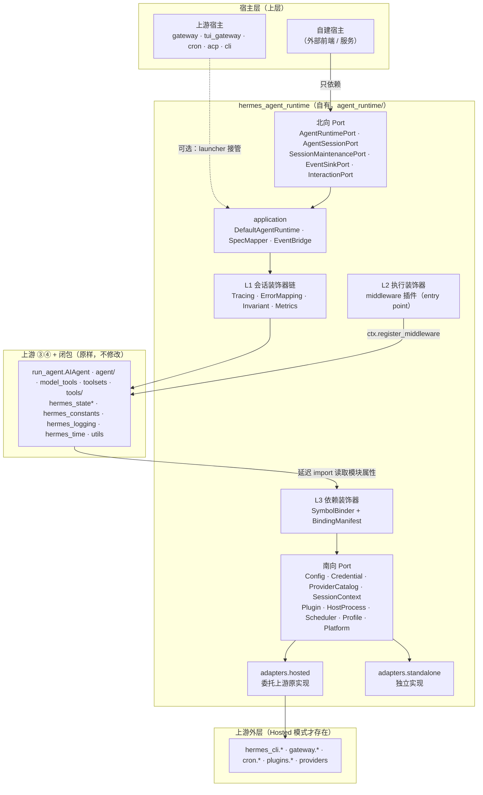
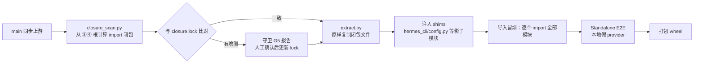

# AgentRuntime 智能体抽取方案

> 装饰器模式 · Port 约束上层调用 · 持续可合并上游主线

| 项 | 值 |
|---|---|
| 依据 | `contract/hermes-business-architecture.drawio` 中的「AgentRuntime 抽取边界」（③ Agent 核心 + ④ 工具能力） |
| 代码基线 | `fc71fb63e5`（上游 NousResearch/hermes-agent v0.21.2） |
| 日期 | 2026-09-13 |
| 数据来源 | 对非测试代码逐文件 AST 扫描 import / 类定义 / 调用点；git 历史统计。复现方式见附录 E |
| 状态 | 设计稿，待评审 |

---

## 0. 结论速览

**不搬动、不修改任何上游文件，而是在上游 ③④ 代码之外包一层「Port + 装饰器」外壳，再用构建脚本把闭包原样打包成独立运行时。**

1. **新建自有顶层目录 `agent_runtime/`**（已确认 `origin/main` 未占用），内含独立发行包 `hermes_agent_runtime`，自带 `pyproject.toml`，**不改上游 `pyproject.toml`**。
2. **北向 Port（上层调用约束）**：宿主只能依赖 `AgentRuntimePort` / `AgentSessionPort` 等协议；它们由上游 `AIAgent` 的真实公开面（18 个公开方法、80 个构造参数、21 个回调）归纳而来。
3. **三级装饰器**：
   - **L1 会话装饰器**：包装 `AgentSessionPort`，承载追踪、指标、异常映射、不变量校验；
   - **L2 执行装饰器**：走上游**官方 middleware 契约**（`llm_request` / `llm_execution` / `tool_request` / `tool_execution`），通过 `hermes_agent.plugins` entry point 注册，零侵入；
   - **L3 依赖装饰器**：`SymbolBinder` 把闭包对外层的 409 个符号引用在「生产代码读取处」替换为委托到南向 Port 的装饰函数。
4. **两种运行模式**：Hosted（适配器委托上游原实现，行为逐字节等价）→ Standalone（构建时抽取 + 影子模块 + 独立适配器）。
5. **合并保障**：`main` 纯镜像；自有提交只在 `agent_runtime/` 与 `contract/`；六类契约守卫（G1–G6）把上游漂移从「运行时报错」提前到「同步时 CI 变红」。

> ⚠️ 与既有决策的关系：`contract/b-line-extraction-options.html` 已弃用「方案 2 · 独立 Python 包」。本方案是它的变体 **方案 2′**——保留独立包的产出，但以「零修改上游 + 构建时抽取」替换「源码分叉」，从而不失去跟随主线的能力。落地前需在该决策文档追加一条 ADR（见 §13）。

---

## 1. 边界与事实基线

### 1.1 抽取边界（来自架构图）

| 范围 | 内容 |
|---|---|
| ③ Agent 核心 | `run_agent.py`、`agent/`（279 文件，约 11.1 万行，8 个子包） |
| ④ 工具能力 | `model_tools.py`、`toolsets.py`、`toolset_distributions.py`、`tools/` |
| 边界外但属于依赖闭包（图中 ◆） | `hermes_state.py` + `hermes_state_*.py`、`hermes_constants.py`、`hermes_logging.py`、`hermes_time.py`、`utils.py` |

**单独抽 ③ 不可行**：`tools → agent` 反向引用 292 处，多于 `agent → tools` 的 153 处；合并为 ③+④ 后内聚度从 0.626 升至 0.754。因此抽取单元固定为 **③ + ④ + 闭包**。

### 1.2 事实基线

| 维度 | 数据 | 对方案的影响 |
|---|---|---|
| 闭包对外层引用 | 409 个符号 / 1,016 处；`hermes_cli` 797 处（58 个模块、289 个符号）、`gateway` 116、`cron` 48、`plugins` 26、`providers` 23 | 南向 Port 的输入清单 |
| 引用时机 | 模块顶层绑定仅 **78 个符号 / 129 处**，其余均为函数体内延迟 import | 延迟 import 在调用时才读模块属性 → L3 装饰器可在运行期生效；顶层绑定必须在导入前安装 |
| `AIAgent` 构造 | 80 个参数，其中 21 个回调；宿主实际使用 63 个 | 需归并为 `RuntimeSpec` 值对象 |
| `AIAgent` 公开方法 | 18 个（14 个 mixin 组装） | 北向 Port 的方法清单 |
| 宿主构造点 | 21 处：gateway 5、tui_gateway 3、hermes_cli 4、scripts 5、cron / acp / batch_runner / plugins 各 1 | Hosted 适配器与 launcher 需覆盖 |
| 宿主方法调用 | `run_conversation` 22、`interrupt` 10、`steer` 7、`get_activity_summary` 7、`close` 5、`shutdown_memory_provider` 5、`redirect` 3 … | Port 方法优先级 |
| 宿主访问私有属性 | **110 处**：hermes_cli 42、gateway 37、tui_gateway 23；如 `_compress_context` 7、`_persist_session` 5、`_invalidate_system_prompt` 4 | 需提升为显式 Port 方法 |
| 已有扩展点 | 12 个 ABC（`MemoryProvider`、`ContextEngine`、`ProviderBase`、`ProviderTransport`、`BaseEnvironment` …）、middleware 4 种、observer hooks 14 个、`hermes_agent.plugins` entry point | 优先复用，不另造 |
| 隐式耦合 | `os.environ` 164 处 / 80 个 `HERMES_*`；`get_hermes_home()` 98 处；模块级可变状态 144 处 | Standalone 模式的主要风险 |
| 上游变更 | 近一年 `agent/` 4,692 次提交、857 位作者，303 个文件被改动；近 90 天 3,534 次 | 任何源码级修改都会持续冲突 |
| 测试耦合 | 1,051 个测试文件 import `agent.*`；1,757 处 patch 目标指向 `agent.*` | 上游测试在 Hosted 模式下原样运行，作为回归网 |

---

## 2. 约束

### 2.1 本需求约束

- **C1 装饰器优先**：新增行为以包装而非修改的方式叠加。
- **C2 Port 约束上层**：上层只依赖协议，不依赖 `run_agent` / `agent.*` / `tools.*` 内部路径。
- **C3 可合并主线**：对上游文件的修改量恒为 0。

### 2.2 仓库既有约束（必须遵守）

| 来源 | 约束 | 本方案的处理 |
|---|---|---|
| `contract/README.md` 规则 1–3 | `main` 纯镜像；自有文件放上游未占用的顶层目录；自有提交走独立分支 + rebase | 目录 `agent_runtime/`，分支 `local/agent-runtime` |
| `contract/README.md` 规则 4 | 不 import 上游内部路径 | 仅 `hermes_agent_runtime.adapters.hosted` 与 `bindings` 两处允许，由 import-linter 契约强制（§9.3） |
| 根 `AGENTS.md` | 提示缓存神圣：对话中途不改系统提示、不换工具集、不重载记忆 | L2 中间件禁止改写历史消息与工具定义；L1 增加不变量校验装饰器（§6.1） |
| 根 `AGENTS.md` | 严格角色交替，不插入合成 user 消息 | 装饰器不注入消息；`steer` 语义原样透传 |
| 根 `AGENTS.md` | 「在生产代码读取处打桩」 | L3 绑定按「消费方读取的模块属性」建清单，而非定义模块 |
| 根 `AGENTS.md` | 会话能力属于会话，不属于进程环境变量 | `SessionContextPort` 基于 `ContextVar` |
| `COMPAT_MANIFEST.md` | 兼容指针 2026-09-14 移除 | `hermes_cli.plugin_compat.warn_once`（56 处）不设 Port，绑定为「可选」 |
| `agent/AGENTS.md` | `model_tools._last_resolved_tool_names` 是进程级全局，委派子代理时存取 | 同进程多会话并发的已知限制，见 §10 |

---

## 3. 方案对比

| | A. 源码迁移重构 | B. 仓内零侵入外壳 | **C. B + 构建时抽取（推荐）** |
|---|---|---|---|
| 做法 | `git mv` 到新包、改 import、切断反向依赖 | 在上游代码之上加 Port + 装饰器，同进程运行 | 在 B 的基础上，按闭包清单**原样复制**上游文件、注入影子模块，产出独立 wheel |
| 上游文件修改 | 数百文件 | 0 | 0 |
| 与主线合并 | 每次 pull 大量冲突（`agent/` 年 4,692 次提交） | 永不冲突 | 永不冲突；同步后重新构建 |
| 能否脱离完整仓库运行 | 能 | 不能（Hosted） | 能（Standalone） |
| 上层调用约束 | 能 | 能 | 能 |
| 风险暴露点 | 合并 | 仅运行时语义漂移 | 语义漂移 + 影子模块覆盖面 |
| 结论 | 弃用 | 阶段 1–2 的形态 | **目标形态** |

**推荐 C，分阶段交付**：先以 B 的形态建立 Port 与装饰器，行为与上游完全一致；再逐个替换南向适配器，最后构建独立包。每个阶段都能独立交付和回滚。

---

## 4. 总体架构



### 4.1 目录结构

```text
agent_runtime/                       # 自有顶层目录（origin/main 未占用）
├── pyproject.toml                   # 独立发行：hermes-agent-runtime；不改上游 pyproject
├── README.md
├── src/hermes_agent_runtime/
│   ├── __init__.py                  # 对外只导出 ports 与 bootstrap
│   ├── bootstrap.py                 # 安装绑定 → 选择适配器 → 返回 AgentRuntimePort
│   ├── ports/
│   │   ├── inbound.py               # 北向 Port（上层调用约束）
│   │   ├── outbound.py              # 南向 Port（运行时对外需求）
│   │   └── errors.py                # 领域异常
│   ├── domain/
│   │   ├── spec.py                  # RuntimeSpec 及其值对象
│   │   ├── events.py                # RuntimeEvent 类型
│   │   └── results.py               # TurnResult
│   ├── application/
│   │   ├── runtime.py               # DefaultAgentRuntime / DefaultAgentSession
│   │   ├── spec_mapper.py           # RuntimeSpec → AIAgent(**kwargs)
│   │   └── event_bridge.py          # 21 个回调 → EventSinkPort / InteractionPort
│   ├── decorators/
│   │   ├── session.py               # L1：AgentSessionPort 装饰器
│   │   └── middleware_plugin.py     # L2：register(ctx) 注册 middleware / hooks
│   ├── bindings/
│   │   ├── manifest.py              # L3：绑定清单（生成 + 人工分类）
│   │   ├── binder.py                # SymbolBinder
│   │   └── launcher.py              # hermes-rt：先装绑定再进入上游 main
│   ├── adapters/
│   │   ├── hosted/                  # 唯一允许 import hermes_cli / gateway / cron 的地方
│   │   └── standalone/
│   └── shims/                       # 仅构建期使用的影子模块模板
├── build/
│   ├── closure_scan.py              # 从 ③④ 根计算闭包
│   ├── closure.lock                 # 文件清单 + sha256（随基线提交）
│   └── extract.py                   # 原样复制 + 注入 shims + 打包 wheel
├── guard/                           # 契约守卫 G1–G6
└── tests/
```

> 包名用 `hermes_agent_runtime` 而不是 `agent_runtime`：避免在仓库根目录运行时，顶层目录 `agent_runtime/` 被当作同名命名空间包遮蔽真实包。

> 目录与文件的完整处理方式（原地不动 / 构建时复制 / 新增），以及全部 Port 与装饰器的清单，见附录 F。

---

## 5. 北向 Port：上层调用约束

### 5.1 归纳原则

- 方法清单 = `AIAgent` 18 个公开方法 ∩ 宿主实际调用，外加由私有属性访问提升而来的维护方法。
- 签名与上游保持一致或更窄，**不扩展语义**，保证 Hosted 模式可逐字节透传。
- 回调分两类：**单向通知** → `EventSinkPort`；**需要返回值的交互** → `InteractionPort`。

### 5.2 协议定义

```python
# src/hermes_agent_runtime/ports/inbound.py
from __future__ import annotations

from typing import Any, Mapping, Optional, Protocol, Sequence, runtime_checkable

from hermes_agent_runtime.domain.events import RuntimeEvent
from hermes_agent_runtime.domain.results import TurnResult
from hermes_agent_runtime.domain.spec import RunRequest, RuntimeSpec


@runtime_checkable
class EventSinkPort(Protocol):
    """宿主实现：接收运行时单向事件（流式增量、工具进度、状态、提示等）。"""

    def emit(self, event: RuntimeEvent) -> None: ...


@runtime_checkable
class InteractionPort(Protocol):
    """宿主实现：运行时需要人参与并拿到返回值的交互。"""

    def clarify(self, question: str, choices: Sequence[str] | None) -> str: ...
    def approve(self, request: Mapping[str, Any]) -> bool: ...
    def read_terminal(self, request: Mapping[str, Any]) -> str: ...
    def capture_secret(self, request: Mapping[str, Any]) -> Optional[str]: ...


@runtime_checkable
class AgentSessionPort(Protocol):
    """一次会话。与 AIAgent 公开方法一一对应，签名不宽于上游。"""

    session_id: str

    def run_turn(self, request: RunRequest) -> TurnResult: ...          # run_conversation
    def chat(self, message: str) -> str: ...                            # chat

    def interrupt(self, message: str | None = None, *, hard: bool = False,
                  tool_reason: str | None = None) -> bool: ...          # interrupt / hard_interrupt
    def steer(self, text: str) -> bool: ...                             # steer
    def redirect(self, text: str) -> bool: ...                          # redirect
    def clear_interrupt(self, *, preserve_redirect: bool = False) -> bool: ...
    def is_interrupted(self) -> bool: ...

    def activity(self) -> Mapping[str, Any]: ...                        # get_activity_summary
    def rate_limit_state(self) -> Any: ...                              # get_rate_limit_state
    def credits_state(self) -> Any: ...                                 # get_credits_state
    def credits_spent_micros(self) -> Optional[int]: ...                # get_credits_spent_micros

    def reset(self, *, previous_messages: list | None = None, old_session_id: str | None = None,
              carry_over_context: bool = False) -> None: ...            # reset_session_state
    def commit_memory(self, messages: list | None = None) -> None: ...  # commit_memory_session
    def release_clients(self) -> None: ...                              # release_clients
    def close(self) -> None: ...                                        # shutdown_memory_provider + close


@runtime_checkable
class SessionMaintenancePort(Protocol):
    """特权维护面：把宿主当前对 AIAgent 私有属性的 110 处访问提升为显式契约。
    仅授予 gateway / tui 这类长会话宿主，普通宿主不可见。"""

    def compress_context(self, **kwargs: Any) -> Any: ...               # _compress_context（7 处）
    def persist(self) -> None: ...                                      # _persist_session（5 处）
    def flush_to_store(self) -> None: ...                               # _flush_messages_to_session_db（3 处）
    def invalidate_system_prompt(self) -> None: ...                     # _invalidate_system_prompt（4 处）
    def set_end_session_on_close(self, value: bool) -> None: ...        # _end_session_on_close（4 处）
    def spawn_background_review(self, messages: list) -> None: ...      # _spawn_background_review（2 处）


@runtime_checkable
class AgentRuntimePort(Protocol):
    """运行时入口：宿主唯一需要持有的对象。"""

    def open_session(self, spec: RuntimeSpec, *, events: EventSinkPort | None = None,
                     interaction: InteractionPort | None = None) -> AgentSessionPort: ...
    def maintenance(self, session: AgentSessionPort) -> SessionMaintenancePort: ...
    def capabilities(self) -> Mapping[str, bool]: ...                   # 当前模式下可用的工具集 / 能力
```

> `SessionMaintenancePort` 中的方法以附录 D 的实测访问为准逐条确认签名；首批只放入访问 ≥ 2 次的项，其余在宿主迁移时按需补齐。

### 5.3 `RuntimeSpec`：80 个构造参数的归并

```python
# src/hermes_agent_runtime/domain/spec.py（节选）
from dataclasses import dataclass, field
from typing import Any, Mapping, Optional, Sequence


@dataclass(frozen=True)
class ModelRoute:
    model: str = ""
    provider: Optional[str] = None
    requested_provider: Optional[str] = None
    base_url: Optional[str] = None
    api_key: Optional[str] = None          # Standalone 下建议留空，交给 CredentialPort
    api_mode: Optional[str] = None
    fallback_model: Optional[Mapping[str, Any]] = None
    reasoning_config: Optional[Mapping[str, Any]] = None
    service_tier: Optional[str] = None
    max_tokens: Optional[int] = None
    request_overrides: Optional[Mapping[str, Any]] = None
    routing: Mapping[str, Any] = field(default_factory=dict)   # providers_allowed/ignored/order/sort/...


@dataclass(frozen=True)
class ToolPolicy:
    enabled_toolsets: Optional[Sequence[str]] = None
    disabled_toolsets: Optional[Sequence[str]] = None
    max_iterations: Optional[int] = None
    run_budget_seconds: Optional[float] = None
    checkpoints: Mapping[str, Any] = field(default_factory=dict)


@dataclass(frozen=True)
class SessionBinding:
    session_id: Optional[str] = None
    parent_session_id: Optional[str] = None
    platform: Optional[str] = None
    user: Mapping[str, Optional[str]] = field(default_factory=dict)   # user_id / user_id_alt / user_name
    chat: Mapping[str, Optional[str]] = field(default_factory=dict)   # chat_id / chat_name / chat_type / thread_id
    gateway_session_key: Optional[str] = None
    pass_session_id: bool = False


@dataclass(frozen=True)
class PromptOptions:
    ephemeral_system_prompt: Optional[str] = None
    prefill_messages: Optional[Sequence[Mapping[str, Any]]] = None
    skip_context_files: bool = False
    load_soul_identity: bool = False
    skip_memory: bool = False
    skip_background_review: bool = False


@dataclass(frozen=True)
class RuntimeSpec:
    route: ModelRoute = ModelRoute()
    tools: ToolPolicy = ToolPolicy()
    session: SessionBinding = SessionBinding()
    prompt: PromptOptions = PromptOptions()
    output: Mapping[str, Any] = field(default_factory=dict)    # quiet_mode / verbose_logging / log_prefix* / ...
    acp: Mapping[str, Any] = field(default_factory=dict)       # acp_command / acp_args / command / args
    capabilities: Optional[Mapping[str, bool]] = None
    passthrough: Mapping[str, Any] = field(default_factory=dict)  # 兜底：上游新增参数的临时通道
```

- `SpecMapper` 负责把 `RuntimeSpec` 摊平为 `AIAgent(**kwargs)`，**以上游 `__init__` 签名为唯一真源**：启动时用 `inspect.signature(AIAgent.__init__)` 校验，未知键直接报错。
- `passthrough` 让上游新增参数无需等待本包发版即可使用；守卫 G1 会提示把它正式纳入值对象。
- 完整映射见附录 B。

### 5.4 回调 → 事件 / 交互

| 上游回调 | 归类 | 目标 |
|---|---|---|
| `stream_delta_callback`、`interim_assistant_callback`、`thinking_callback`、`reasoning_callback` | 通知 | `RuntimeEvent.StreamDelta` / `Interim` / `Thinking` / `Reasoning` |
| `tool_start_callback`、`tool_progress_callback`、`tool_complete_callback`、`tool_gen_callback`、`step_callback` | 通知 | `ToolStarted` / `ToolProgress` / `ToolCompleted` / `ToolGenerating` / `Step` |
| `status_callback`、`notice_callback`、`notice_clear_callback`、`event_callback`、`reaction_callback` | 通知 | `Status` / `Notice` / `NoticeCleared` / `Raw` / `Reaction` |
| `clarify_callback` | 交互 | `InteractionPort.clarify` |
| `read_terminal_callback`、`read_preview_callback`、`drive_preview_callback`、`read_window_below_callback` | 交互 | `InteractionPort.read_terminal` 及同类方法 |
| `setup_mcp_callback`、`tour_callback` | 交互 | 按宿主能力可选实现，缺省返回「不支持」 |
| 模块级 `tools.terminal_tool.set_approval_callback`、`set_sudo_password_callback`、`tools.skills_tool.set_secret_capture_callback` 等 | 交互（进程级） | `InteractionPort.approve` / `capture_secret`，由 `EventBridge` 按 `ContextVar` 中的会话 ID 路由 |

---

## 6. 装饰器设计

### 6.1 L1 会话装饰器

装饰器实现与被装饰对象相同的 `AgentSessionPort`，可任意叠加、顺序可配。

```python
# src/hermes_agent_runtime/decorators/session.py（节选）
from __future__ import annotations

from typing import Any

from hermes_agent_runtime.ports.inbound import AgentSessionPort


class SessionDecorator:
    """基类：默认把所有调用委托给内层会话，子类只覆写关心的方法。"""

    def __init__(self, inner: AgentSessionPort) -> None:
        self._inner = inner

    def __getattr__(self, name: str) -> Any:
        return getattr(self._inner, name)


class ErrorMappingDecorator(SessionDecorator):
    """把上游异常映射为领域异常，宿主不再 import 上游异常类型。"""

    def run_turn(self, request):
        try:
            return self._inner.run_turn(request)
        except Exception as exc:  # noqa: BLE001 — 映射后原样保留 __cause__
            raise map_upstream_error(exc) from exc


class CacheInvariantDecorator(SessionDecorator):
    """调试 / CI 模式下校验：同一会话内系统提示字节稳定、工具集不变。"""

    def run_turn(self, request):
        before = self._fingerprint()
        result = self._inner.run_turn(request)
        after = self._fingerprint()
        if before and after and before != after and not result.compressed:
            raise InvariantViolation("system prompt or toolset changed mid-conversation")
        return result


class TracingDecorator(SessionDecorator):
    def run_turn(self, request):
        with self._tracer.span("agent.turn", session_id=self._inner.session_id):
            return self._inner.run_turn(request)
```

| 装饰器 | 职责 | 默认启用 |
|---|---|---|
| `ErrorMappingDecorator` | 异常映射 | 是 |
| `TracingDecorator` / `MetricsDecorator` | 追踪、耗时、token / 费用 | 是 |
| `CacheInvariantDecorator` | 提示缓存、角色交替不变量 | CI / 调试 |
| `ConcurrencyGuardDecorator` | 同一会话串行化 `run_turn`（与上游 turn lease 互补） | 是 |
| `CapabilityGateDecorator` | 拒绝当前模式不可用的工具集请求（Standalone） | Standalone |

### 6.2 L2 执行装饰器：复用上游 middleware 契约

上游 `docs/middleware/README.md` 与 `hermes_cli/plugins.py::register_middleware` 已提供装饰链：执行类 middleware 接收 `next_call`，多插件按注册顺序嵌套，失败放行（fail-open）。本包以 pip entry point 注册为插件，**不改任何上游文件**。

```toml
# agent_runtime/pyproject.toml（节选）
[project.entry-points."hermes_agent.plugins"]
agent-runtime = "hermes_agent_runtime.decorators.middleware_plugin"
```

```python
# src/hermes_agent_runtime/decorators/middleware_plugin.py
def register(ctx):
    ctx.register_middleware("llm_request", _route_policy)       # 只改路由相关键，禁止改 messages / tools
    ctx.register_middleware("llm_execution", _llm_span)         # 包装真实 provider 调用
    ctx.register_middleware("tool_request", _tool_arg_policy)   # 在审批与护栏之前生效，谨慎使用
    ctx.register_middleware("tool_execution", _tool_span)       # 包装真实工具执行
    ctx.register_hook("post_tool_call", _emit_tool_event)


def _llm_span(**kw):
    with tracer.span("llm.call", model=kw.get("model"), provider=kw.get("provider")):
        return kw["next_call"](kw["request"])


def _tool_span(**kw):
    with tracer.span("tool.call", tool=kw.get("tool_name")):
        return kw["next_call"](kw["args"])
```

**规则**

- `llm_request` 中间件**只允许**修改 `model`、`extra_headers`、超时等路由键；修改 `messages`、`input`、`tools`、`system` 一律拒绝，否则破坏提示缓存。本包提供 `guarded_request_middleware` 装饰器自动校验。
- 上游 middleware 只对**已启用插件**生效：Hosted 模式需 `hermes plugins enable agent-runtime`，Standalone 模式由 `PluginPort` 直接注入。
- 上游约定 fail-open：本包中间件自身不得承担安全兜底，安全策略仍由上游审批 / 护栏执行。

### 6.3 L3 依赖装饰器：SymbolBinder

**原理**：闭包内 1,016 处外向引用中，除模块顶层的 129 处外，其余都是函数体内（或 `TYPE_CHECKING` 块内）的 `from hermes_cli.config import load_config_readonly`。这种语句**每次执行时才读取模块属性**，因此只要把 `hermes_cli.config.load_config_readonly` 替换为装饰后的函数，所有延迟 import 都会拿到新实现。模块顶层的 129 处引用在导入时就已绑定，必须在导入闭包之前安装。

```python
# src/hermes_agent_runtime/bindings/binder.py（节选）
from __future__ import annotations

import functools
import importlib
from dataclasses import dataclass
from typing import Any, Callable


@dataclass(frozen=True)
class Binding:
    module: str            # 生产代码读取的模块，如 "hermes_cli.config"
    name: str              # 符号名，如 "load_config_readonly"
    port: str              # 南向 Port 名，如 "config"
    method: str            # Port 方法，如 "read"
    required: bool = True  # False：上游移除时跳过（如 plugin_compat.warn_once）
    top_level: bool = False


_ORIGINALS: dict[tuple[str, str], Any] = {}


def original_of(module: str, name: str) -> Any:
    """Hosted 适配器取上游原函数；未安装绑定时退化为模块当前属性。"""
    try:
        return _ORIGINALS[(module, name)]
    except KeyError:
        return getattr(importlib.import_module(module), name)


class SymbolBinder:
    def __init__(self, ports: dict[str, Any]) -> None:
        self._ports = ports

    def install(self, bindings: list[Binding]) -> None:
        for b in bindings:
            try:
                mod = importlib.import_module(b.module)
                original = getattr(mod, b.name)
            except (ImportError, AttributeError):
                if b.required:
                    raise BindingDrift(b)
                continue
            _ORIGINALS.setdefault((b.module, b.name), original)   # 重复 install 不覆盖真正的原函数
            setattr(mod, b.name, self._decorate(original, b))

    def _decorate(self, original: Callable, b: Binding) -> Callable:
        port_method = getattr(self._ports[b.port], b.method)

        @functools.wraps(original)
        def bound(*args, **kwargs):
            return port_method(*args, **kwargs)

        bound.__hermes_binding__ = b
        bound.__wrapped_original__ = original
        return bound

    def uninstall(self) -> None:
        for (module, name), original in _ORIGINALS.items():
            setattr(importlib.import_module(module), name, original)
        _ORIGINALS.clear()
```

**要点**

- **Hosted 模式下 Port 适配器直接调用 `__wrapped_original__`**：行为与上游一致，仅多一层函数调用。配置读取是热路径（上游注释：`load_config` 缓存命中约 265µs，其中约一半是深拷贝，`load_config_readonly` 正是为跳过它而存在），装饰层必须保持零分配。
- **顶层绑定的 78 个符号**（附录 A.2）必须在 `import run_agent` 之前 `install`，由 `bootstrap()` 或 `hermes-rt` launcher 保证；守卫 G3 在闭包新增顶层外向 import 时报警。
- 工具类模块**不设 Port**，但是否能整模块随行复制取决于它自身的依赖（已逐个核实）：`hermes_cli/timefmt.py`、`sizefmt.py` 无本地依赖，`route_identity.py` 只依赖闭包内的 `agent.agent_init`，均可原样随行；`_subprocess_compat.py` 依赖 `gateway.status`、`timeouts.py` 依赖 `hermes_cli.config`，可以随行，但这两个依赖要由影子模块转交 `HostProcessPort` / `ConfigPort`；`cfg_get` 定义在 `hermes_cli/config.py` 内，不能整模块复制，只在 config 影子模块中提供（详见附录 F.1）。
- 绑定清单按「消费方读取处」建立：上游若把定义挪到兄弟模块，但读取处不变，绑定仍然有效；读取处变化由 G2 发现。

### 6.4 可选：通过 launcher 接管上游宿主

上游宿主（gateway、tui_gateway 等）直接构造 `AIAgent`，改它们等于修改上游。替代做法是提供自有启动器，先装绑定，再进入上游入口：

```python
# src/hermes_agent_runtime/bindings/launcher.py
def main() -> int:
    from hermes_agent_runtime.bootstrap import bootstrap
    bootstrap(mode="hosted", adopt_upstream_hosts=True)   # 安装 L3 绑定，并把 run_agent.AIAgent 替换为子类
    from hermes_cli.main import main as upstream_main
    return upstream_main()
```

- 替换采用**子类** `DecoratedAIAgent(AIAgent)` 而不是包装对象：保留 `isinstance` 判断与宿主的 110 处私有属性访问。
- 上游兄弟模块在函数体内 `from run_agent import AIAgent`（11 处），后台复盘、`/btw` 等 fork 出的子代理同样会被装饰。子类需带重入保护，避免重复叠加。
- 这一步是**可选增强**：不启用时，上游宿主行为完全不变；自建宿主照常只走北向 Port。

---

## 7. 南向 Port：运行时对外需求

### 7.1 外向符号分桶

| 桶 | 处理方式 | 典型符号 |
|---|---|---|
| ① 工具类模块 | 随行复制，不设 Port；其自身的外部依赖走影子模块 | `timefmt`、`sizefmt`、`route_identity`（可原样随行）；`_subprocess_compat.*`（39，依赖 `gateway.status`）、`timeouts`（依赖 `hermes_cli.config`）；`config.cfg_get`（只在影子模块中提供） |
| ② 配置 / 凭证 / 模型目录 | Port + 双适配器 | `hermes_cli.config`、`auth`、`runtime_provider`、`providers`、`models`、`copilot_auth`、`anon_auth`、`nous_account` |
| ③ 宿主上下文 | Port + 双适配器 | `gateway.session_context`、`gateway.status`、`gateway.config`、`gateway.platforms.base`、`cron.*`、`hermes_cli.profiles` |
| ④ 扩展系统 | Port；Standalone 下可为空实现 | `hermes_cli.plugins`、`lifecycle`、`middleware` |
| ⑤ 兼容层 | 可选绑定，不设 Port | `hermes_cli.plugin_compat.warn_once`（56 处，2026-09-14 移除） |

### 7.2 Port 清单

| Port | 覆盖符号（引用次数） | 核心方法 | Standalone 实现 |
|---|---|---|---|
| `ConfigPort` | `load_config` 70、`load_config_readonly` 63、`read_raw_config` 16、`get_env_value` 6、`get_config_path` 3、`save_config` 2、`DEFAULT_CONFIG` 2、`load_env` 2 | `read()` / `read_mutable()` / `read_raw()` / `env(name)` / `path()` / `save(cfg)` | 内存 dict 或指定 YAML，`save` 可禁用 |
| `CredentialPort` | `hermes_cli.auth` 85、`runtime_provider` 24、`copilot_auth` 15、`anon_auth` 18、`nous_account` 13 | `resolve_runtime(requested, explicit_api_key)` / `provider_auth_state(pid)` / `pool_read` / `pool_write` | 显式密钥 + 环境变量；OAuth 类 provider 不支持 |
| `ProviderCatalogPort` | `hermes_cli.providers` 30、`hermes_cli.models` 31、`providers.get_provider_profile` 19 | `profile(name)` / `normalize(name)` / `api_mode(route)` / `is_actual_route(url)` | 随包携带一份 provider 快照 |
| `SessionContextPort` | `gateway.session_context` 46（`get_session_env` 33） | `get(name, default)` / `bind(**vars)` / `current_session_id()` | 自有 `ContextVar` 实现，语义同上游「ContextVar 优先，否则 `os.environ`」 |
| `PluginPort` | `hermes_cli.plugins` 51、`lifecycle` 17、`middleware` 9 | `invoke_hook(name, **kw)` / `has_hook(name)` / `apply_llm_request(...)` / `run_tool_execution(...)` | 仅本包注册的中间件链；第三方插件不加载 |
| `HostProcessPort` | `gateway.status` 17（另有 `_subprocess_compat.py` 间接依赖） | `pid_exists` / `process_start_time` / `running_pid` | `psutil` 实现 |
| `SchedulerPort` | `cron.jobs` 26、`cron.scheduler` 12 等，共 48 | `list_jobs` / `get_job` / `update_job` / … | 不提供 → `cronjob` 工具集禁用 |
| `ProfilePort` | `hermes_cli.profiles` 20（`get_active_profile_name` 14） | `active_profile()` / `profile_dir(name)` | 固定单 profile |
| `PlatformPort` | `gateway.config` 11、`gateway.platforms.base` 10 | `platform_config(name)` / `resolve_proxy_url(...)` | 不提供 → `send_message` 等消息工具禁用 |

长尾（`hermes_cli` 共 58 个模块）由 `manifest.py` 自动生成候选清单：**未分类的符号默认 Hosted 直通，并在构建报告中列为「Standalone 未覆盖」**，不会静默丢失。

### 7.3 示例

```python
# src/hermes_agent_runtime/ports/outbound.py（节选）
from typing import Any, Mapping, Optional, Protocol


class ConfigPort(Protocol):
    def read(self) -> Mapping[str, Any]: ...                 # 只读视图，调用方禁止修改
    def read_mutable(self) -> dict[str, Any]: ...            # 深拷贝
    def read_raw(self) -> dict[str, Any]: ...
    def env(self, name: str, default: str = "") -> str: ...
    def save(self, cfg: Mapping[str, Any], **kw: Any) -> None: ...


class SessionContextPort(Protocol):
    def get(self, name: str, default: str = "") -> str: ...
    def current_session_id(self) -> Optional[str]: ...
```

```python
# src/hermes_agent_runtime/adapters/hosted/config.py —— 唯一允许 import hermes_cli 的层
from hermes_agent_runtime.bindings.binder import original_of


class HostedConfig:
    def read(self):
        return original_of("hermes_cli.config", "load_config_readonly")()

    def read_mutable(self):
        return original_of("hermes_cli.config", "load_config")()

    def read_raw(self):
        return original_of("hermes_cli.config", "read_raw_config")()
    # ...
```

> Hosted 适配器必须调用**原函数**（`original_of`）而不是模块当前属性，否则会调回自身形成递归。

---

## 8. 两种运行模式与构建时抽取

### 8.1 模式对比

| | Hosted | Standalone |
|---|---|---|
| 依赖 | 完整 hermes-agent 安装 | 仅 `hermes-agent-runtime` wheel |
| 南向适配器 | 委托上游原实现 | 独立实现（§7.2） |
| 行为 | 与上游一致 | 能力子集，由 `capabilities()` 声明 |
| 用途 | 建立 Port / 装饰器；上游测试原样回归 | 嵌入外部服务、独立部署 |

### 8.2 构建时抽取流程



- **原样复制**：闭包文件一个字节都不改，sha256 写入 `closure.lock`。任何「顺手修一下」都会破坏可重建性，一律禁止。
- **影子模块**：由绑定清单生成，只暴露被闭包实际使用的符号，函数体委托到南向 Port；未覆盖的符号抛 `CapabilityUnavailable("hermes_cli.kanban_db.connect is not available in standalone runtime")`，把「运行到某分支才 ImportError」变成可诊断的明确错误。
- **能力门控**：Scheduler / Platform / Kanban 等 Port 缺席时，`SpecMapper` 自动把相应工具集加入 `disabled_toolsets`。这样模型根本看不到这些工具，既不会误调用，也不会在对话中途改变工具集。
- 构建产物（`build/stage/`）**不提交**。

---

## 9. 持续合并主线的保障

### 9.1 分支与同步

```sh
git checkout main && git pull                 # 永远快进：main 无自有提交
git checkout local/agent-runtime
git rebase main                               # 永不冲突：只新增 agent_runtime/ 与 contract/
python -m agent_runtime.guard --all           # 守卫 G1–G6
python agent_runtime/build/extract.py --check # 闭包漂移检查（不产出 wheel）
```

建议**每周同步一次**，与上游发版节奏对齐；守卫变红时按 §9.2 的处置表修复，修复只落在 `agent_runtime/` 内。

### 9.2 契约守卫

| 守卫 | 检查内容 | 基线来源 | 变红时的处置 |
|---|---|---|---|
| **G1** 构造与方法面 | `AIAgent.__init__` 80 个参数、18 个公开方法签名、`SessionMaintenancePort` 依赖的私有属性 | `inspect.signature` 快照 | 新参数先走 `passthrough`，再并入值对象；删参数则同步修改 `SpecMapper` |
| **G2** 绑定清单 | 409 个外向符号在读取模块中存在且签名兼容 | 绑定清单快照 | 更新清单；读取处迁移时同步改 `Binding.module` |
| **G3** 顶层外向 import | 闭包内新增的模块级外向 import | AST 扫描 | 加入 `top_level=True` 绑定，确认 bootstrap 顺序 |
| **G4** 扩展契约 | `MIDDLEWARE_SCHEMA_VERSION == "hermes.middleware.v1"`、`VALID_HOOKS` 集合、`hermes_agent.plugins` 分组名 | 常量快照 | 适配新版本契约，L2 插件按版本分支 |
| **G5** 闭包漂移 | 闭包文件增删、sha 变化统计 | `closure.lock` | 新文件纳入闭包；外向依赖进入 G2 / G3 |
| **G6** 定时移除 | 兼容层到期（2026-09-14）等已公告的移除 | `COMPAT_MANIFEST.md` 日期 | 相关绑定置为 `required=False` |

### 9.3 边界强制

- **import-linter**（只配置在 `agent_runtime/pyproject.toml`，不影响上游）：
  - `hermes_agent_runtime.ports`、`domain`、`application`、`decorators` 禁止 import `hermes_cli`、`gateway`、`cron`、`tui_gateway`、`plugins`；
  - 只有 `adapters.hosted` 与 `bindings` 允许 import 上游外层；
  - 自建宿主禁止 import `run_agent`、`agent`、`tools`。
- 沿用 `contract/README.md` 的验收检查，并增加一条：`git diff --name-status main...local/agent-runtime` 只允许 `A` 开头的行。

---

## 10. 与上游不变量的兼容性

| 不变量 / 现状 | 风险 | 对策 |
|---|---|---|
| 提示缓存神圣 | L2 中间件改写 `messages` / `tools` 会让缓存失效 | `guarded_request_middleware` 白名单校验；`CacheInvariantDecorator` 在 CI 中开启 |
| 严格角色交替 | 装饰器注入消息 | 装饰器只观察与路由，禁止构造消息；`steer` / `redirect` 原样透传 |
| 会话能力属于会话 | 以环境变量判断宿主类型 | `SessionContextPort` 基于 `ContextVar`；`capabilities` 由 `RuntimeSpec` 声明，不读环境变量 |
| 「在读取处打桩」 | 绑定到定义模块不生效 | 绑定清单按读取模块建立；G2 校验 |
| 进程级回调（`set_approval_callback` 等） | 同进程多会话串线 | `EventBridge` 注册单一进程级回调，再按 `ContextVar` 会话 ID 分发到各会话的 `InteractionPort` |
| `model_tools._last_resolved_tool_names` 进程全局 | 并发会话读到瞬时旧值 | 与上游现状一致，不在本方案中修复；文档标注，并建议 Standalone 默认「一进程一活跃会话」 |
| `os.environ` 164 处 / 80 个 `HERMES_*` | Standalone 无法拦截环境变量读取 | 启动时由 `RuntimeSpec` 物化到进程环境；同一进程内不同租户的环境变量级配置不隔离，需多进程部署 |
| `get_hermes_home()` 98 处 | 状态写入 `~/.hermes` | Standalone 为每个运行时实例设置独立 `HERMES_HOME` 工作目录 |

---

## 11. 分阶段实施路线

| 阶段 | 交付物 | 退出标准 | 粗估 |
|---|---|---|---|
| **P0 基线与守卫** | `closure_scan.py`、`closure.lock`、绑定清单生成器、G1–G6、同步脚本、ADR | 在 `fc71fb63e5` 上守卫全绿；`git diff main...` 只有新增 | 3–5 人日 |
| **P1 北向 Port + Hosted 运行时** | `ports/`、`domain/`、`SpecMapper`、`EventBridge`、`DefaultAgentRuntime`、示例自建宿主 | 同一请求经 Port 与直接调用 `AIAgent`，产出的消息序列一致（差分测试） | 6–8 人日 |
| **P2 装饰器链** | L1 装饰器、L2 middleware 插件、L3 `SymbolBinder`（Hosted 恒等）、可选 launcher | 装绑定后上游 `tests/agent` 原样通过；热路径开销 < 5%（基准测试） | 6–8 人日 |
| **P3 Standalone 适配器** | Config / Credential / ProviderCatalog / SessionContext / Plugin / Profile 的独立实现；能力门控 | 无 `hermes_cli` / `gateway` / `cron` 时，E2E 完成「多轮对话 + 文件工具 + 终端工具 + 记忆」 | 10–12 人日 |
| **P4 构建时抽取与发布** | `extract.py`、shims 生成、导入冒烟、wheel 发布流水线 | 干净虚拟环境安装 wheel 后 E2E 通过；构建可重复（同基线 sha 一致） | 5–8 人日 |
| **P5 持续同步** | 每周同步、守卫处置手册 | 连续 4 次同步无人工改动上游文件 | 常态化 |

> 估算基于当前代码规模，未计入评审与联调等待时间。

---

## 12. 测试策略

1. **差分测试（核心）**：本地起一个假 provider（兼容 OpenAI 协议的桩服务，`base_url` 指向它），同一脚本化对话分别经「直接 `AIAgent`」与「Port 运行时」执行，断言消息角色序列、工具调用序列、系统提示字节一致。
2. **上游回归网**：Hosted 模式装好 L3 绑定后，原样运行上游 `tests/agent`、`tests/tools`，证明恒等绑定不改变行为。上游 1,757 处 patch 目标因此继续有效。
3. **契约测试**：只断言数据之间的关系，不冻结当前值（沿用根 `AGENTS.md` 的测试原则）。例如「`SpecMapper` 的输出键 ⊆ `AIAgent.__init__` 参数集」。
4. **真实导入 E2E**：配置、凭证、会话上下文相关用例一律对临时 `HERMES_HOME` 走真实导入，不用 mock（根 `AGENTS.md` 要求）。
5. **延迟 import 覆盖**：因为 87% 的外向引用在函数体内，Standalone 冒烟需按工具集逐个触发调用路径，而不是只 import 一遍模块。
6. **环境前提**：上游 `requires-python = ">=3.11,<3.14"`；当前开发机只有系统 Python 3.9 且无虚拟环境，P0 之前需先建好 3.11+ 环境。

---

## 13. 风险与待决策项

### 13.1 风险

| 风险 | 概率 | 影响 | 对策 |
|---|---|---|---|
| 上游再次大规模拆分（如 2026-09 一次搬动 1,148 个名字） | 中 | G2 / G5 大面积变红 | 绑定清单自动生成 + 按读取处建模；一次同步集中处理 |
| 新增顶层外向 import 绕过 L3 | 中 | Standalone 导入失败 | G3 在同步时拦截 |
| middleware 契约升级到 v2 | 低 | L2 插件失效 | G4 拦截；按版本分支 |
| Standalone 覆盖面不足 | 高 | 部分工具不可用 | 能力门控提前禁用，并列入构建报告；按业务需要逐步补 Port |
| 私有属性访问提升不完整 | 中 | 自建宿主缺维护能力 | 以附录 D 为清单逐项迁移；未提升前由 Hosted 宿主兜底 |
| 进程级全局状态并发 | 中 | 多会话串线 | 一进程一活跃会话；需要并发时多进程部署 |

### 13.2 需要你确认的决策

1. **ADR 变更**：是否在 `contract/b-line-extraction-options.html` 中新增「方案 2′：零修改上游 + 构建时抽取」，并说明它与方案 1（黑盒 `hermes serve`）的分工：对话前端走方案 1，嵌入式运行时走方案 2′。
2. **launcher 接管上游宿主（§6.4）** 是否纳入 P2，还是只服务自建宿主。
3. **Standalone 首批能力范围**：建议首批包含对话、文件、终端、记忆、技能；不含 cron、kanban、消息投递、OAuth 类 provider。
4. **发行名**：`hermes-agent-runtime` / `hermes_agent_runtime` 是否可用，以及是否发布到内部 PyPI。

---

## 附录 A　外向符号绑定清单

### A.1 按 Port 汇总（前列符号）

| Port | 模块 | 符号（顶层 / 延迟引用次数） |
|---|---|---|
| ConfigPort | `hermes_cli.config`（235） | `load_config`（3/67）、`load_config_readonly`（0/63）、`cfg_get`（10/14，纯函数随行）、`read_raw_config`（2/14）、`get_compatible_custom_providers`（0/9）、`get_env_value`（0/6）、`get_config_path`（0/3）、`apply_custom_provider_tls_to_client_kwargs`（0/3）、`get_custom_provider_context_length`（0/3）、`save_config`（0/2）、`DEFAULT_CONFIG`（1/1）、`load_env`（1/1） |
| CredentialPort | `hermes_cli.auth`（85） | `PROVIDER_REGISTRY`（1/9）、`normalize_actual_base_url`（0/9）、`resolve_nous_runtime_credentials`（0/4）、`get_provider_auth_state`（0/4）、`resolve_api_key_provider_credentials`（0/3）、`resolve_codex_runtime_credentials`（1/1）、`read_credential_pool` / `write_credential_pool`（顶层 1）、若干私有 `_load_auth_store` / `_save_auth_store` / `_auth_store_lock` |
| CredentialPort | `hermes_cli.runtime_provider`（24） | `resolve_runtime_provider`（1/10）、`_get_named_custom_provider`（0/6） |
| CredentialPort | `hermes_cli.copilot_auth`（15）、`anon_auth`（18）、`nous_account`（13） | `resolve_copilot_token`、`get_copilot_api_token`、`ensure_portal_identity`、`get_nous_portal_account_info` … |
| ProviderCatalogPort | `hermes_cli.providers`（30）、`hermes_cli.models`（31）、`providers`（21） | `is_actual_route`（13）、`nous_api_mode`（5）、`get_provider_profile`（19）、`normalize_provider`、`deepinfra_base_url` … |
| SessionContextPort | `gateway.session_context`（46） | `get_session_env`（2/31）、`async_delivery_supported`（4）、`set_current_session_id`（3）、`scoped_current_session_id`（1） |
| PluginPort | `hermes_cli.plugins`（51）、`lifecycle`（17）、`middleware`（9） | `get_plugin_manager`（9）、`discover_plugins`（1/7）、`_ensure_plugins_discovered`（8）、`invoke_hook`（11+2）、`has_hook`（6+1）、`apply_tool_request_middleware`（3）、`run_tool_execution_middleware`（3） |
| HostProcessPort | `gateway.status`（17） | `_pid_exists`（8）、`get_process_start_time`（6） |
| SchedulerPort | `cron.jobs`（26）、`cron.scheduler`（12） | `list_jobs`、`get_job`、`update_job`、`pause_job`、`resume_job`、`get_running_job_ids` …（主要来自 `tools/cronjob_tools.py`、`agent/monitoring/cron_health.py`） |
| ProfilePort | `hermes_cli.profiles`（20） | `get_active_profile_name`（14）、`profile_exists`（2） |
| PlatformPort | `gateway.config`（11）、`gateway.platforms.base`（10） | `Platform`（6）、`BasePlatformAdapter`（5）、`resolve_proxy_url`（2） |
| 随行（工具类，依赖见附录 F.1） | `hermes_cli._subprocess_compat`（39） | `windows_hide_flags`（21/6）、`harden_git_argv`、`noninteractive_git_env`、`IS_WINDOWS`、`kill_process_tree` |
| 可选（兼容层） | `hermes_cli.plugin_compat`（56） | `warn_once`（0/56） |

### A.2 必须在导入前安装的顶层绑定（78 个符号 / 129 处）

引用次数最多的几项：`_subprocess_compat.windows_hide_flags` 21、`config.cfg_get` 10、`timeouts.get_provider_request_timeout` 5、`config.load_config` 3、`_subprocess_compat.harden_git_argv` / `noninteractive_git_env` / `IS_WINDOWS` 各 3、`route_identity.normalize_route_base_url` 3、`timefmt.coerce_epoch` 3、`config.read_raw_config` 2、`gateway.session_context.get_session_env` 2、`hermes_cli.__version__` 2。

另有 `hermes_cli.auth` 的 21 个符号（多数为 `_` 开头的私有函数，如 `_load_auth_store`、`_decode_jwt_claims`）在 `agent/credential_pool.py`、`agent/account_usage.py` 顶层导入；`cron.jobs` 的 18 个符号在 `tools/cronjob_tools.py`、`tools/cronjob_job_args.py`、`agent/monitoring/cron_health.py` 顶层导入。依赖私有符号意味着上游可以随时改名而不做任何兼容，这两处应作为 G2 的重点监控对象。完整清单由 `bindings/manifest.py` 生成，并纳入 G3。

---

## 附录 B　`AIAgent.__init__` → `RuntimeSpec` 映射

| 值对象 | 上游参数 |
|---|---|
| `ModelRoute` | `base_url`、`api_key`、`provider`、`api_mode`、`model`、`requested_provider`、`fallback_model`、`credential_pool`*、`reasoning_config`、`service_tier`、`max_tokens`、`request_overrides`、`providers_allowed`、`providers_ignored`、`providers_order`、`provider_sort`、`provider_require_parameters`、`provider_data_collection`、`openrouter_min_coding_score` |
| `ToolPolicy` | `enabled_toolsets`、`disabled_toolsets`、`max_iterations`、`iteration_budget`*、`run_budget_seconds`、`checkpoints_enabled`、`checkpoint_max_snapshots`、`checkpoint_max_total_size_mb`、`checkpoint_max_file_size_mb` |
| `SessionBinding` | `session_id`、`parent_session_id`、`session_db`*、`platform`、`user_id`、`user_id_alt`、`user_name`、`chat_id`、`chat_name`、`chat_type`、`thread_id`、`gateway_session_key`、`pass_session_id` |
| `PromptOptions` | `ephemeral_system_prompt`、`prefill_messages`、`skip_context_files`、`load_soul_identity`、`skip_memory`、`skip_background_review` |
| `output` | `quiet_mode`、`verbose_logging`、`log_prefix_chars`、`log_prefix`、`tool_progress_mode`、`save_trajectories` |
| `acp` | `acp_command`、`acp_args`、`command`、`args` |
| `capabilities` | `capabilities` |
| 回调（§5.4） | 21 个 `*_callback` → `EventSinkPort` / `InteractionPort` |
| 忽略 | `tool_delay`（上游已标注弃用） |

\* 带星号的参数是运行期对象，不适合放进冻结值对象。`SpecMapper` 通过 `RuntimeResources`（会话存储、凭证池、迭代预算）单独注入：Hosted 模式由上游对象提供，Standalone 模式由对应 Port 工厂创建。

---

## 附录 C　宿主构造点（Hosted 适配与 launcher 覆盖面）

| 宿主 | 位置 |
|---|---|
| gateway | `gateway/run_turn.py:1148`、`gateway/run_turn.py:2165`、`gateway/run_turn_runner.py:1017`、`gateway/slash_commands_session.py:628`、`gateway/platforms/api_server.py:2169` |
| tui_gateway | `tui_gateway/server.py:2298`、`tui_gateway/methods_prompt.py:990`、`tui_gateway/methods_prompt.py:1083` |
| cron | `cron/scheduler.py:2153` |
| acp_adapter | `acp_adapter/session.py:421` |
| hermes_cli | `hermes_cli/cli_agent_setup_mixin.py:534`、`hermes_cli/cli_commands_mixin.py:1938`、`hermes_cli/oneshot.py:475`、`hermes_cli/prompt_size.py:61` |
| 其他 | `batch_runner.py:247`、`plugins/platforms/feishu/feishu_comment.py:499`、`scripts/`（5 处） |

---

## 附录 D　宿主私有属性访问（需提升为 `SessionMaintenancePort` 的候选）

| 私有属性 | 访问次数 | 建议 |
|---|---|---|
| `_compress_context` | 7 | `compress_context()` |
| `_persist_session` | 5 | `persist()` |
| `_last_flushed_db_idx` | 5 | 只读 `flush_cursor` 属性 |
| `_print_fn` | 5 | 归入 `EventSinkPort` |
| `_invalidate_system_prompt` | 4 | `invalidate_system_prompt()`（仅限压缩 / 会话切换场景） |
| `_end_session_on_close` | 4 | `set_end_session_on_close()` |
| `_gateway_turn_process_task_id` / `_baseline` / `_epoch` | 4 / 4 / 2 | 网关专用，保留在 Hosted 适配器内，不进入公共 Port |
| `_flush_messages_to_session_db` | 3 | `flush_to_store()` |
| `_session_db_created`、`_session_messages`、`_db_flush_scan_prefix` | 3 / 3 / 3 | 只读诊断视图 `store_state()` |
| `_compression_skipped_due_to_lock` | 3 | 并入 `TurnResult.compression` |
| `_on_session_title`、`_session_title_hint` | 3 / 2 | 归入事件 `SessionTitled` |
| `_cached_system_prompt` | 3 | 只读 `system_prompt_fingerprint()`，不暴露原文 |
| `_spawn_background_review` | 2 | `spawn_background_review()` |
| `_fallback_activated`、`_fallback_chain`、`_fallback_model`、`_primary_runtime`、`_restore_primary_runtime` | 各 2 | 只读 `route_state()` + `restore_primary_route()` |
| 其余 | 共约 40 处 | 按宿主迁移逐项评估 |

按宿主统计：hermes_cli 42、gateway 37、tui_gateway 23、acp_adapter 5、其他 3（batch_runner / cli / cron 各 1）。

---

## 附录 E　数据来源与复现

| 数据 | 方法 |
|---|---|
| 内聚度、双向依赖、主题簇 | AST 扫描全部非测试 `.py` 的 import 语句，按「模块顶层 / 函数体内 / `TYPE_CHECKING`」分类 |
| 外向符号清单（409） | 闭包内 `from X import Y` 中 X 属于外层包的 (X, Y) 去重计数 |
| `AIAgent` 公开面 | 解析 `run_agent.py::AIAgent` 与其 14 个 mixin 类的方法定义 |
| 宿主构造参数与方法调用 | 闭包外文件中 `AIAgent(...)` 的关键字参数，以及接收者名匹配 `agent` 的属性访问（启发式，可能略有低估） |
| 扩展点 | 闭包内继承 `ABC` / `Protocol` 的类，以及 `register_*` / `set_*_callback` 函数 |
| 上游变更频率 | `git log --since=2025-09-13 --oneline -- <path>` |

**局限**：静态分析不包含 `importlib` 动态导入、插件发现和字符串形式的反射调用，实际耦合只会多不会少。P0 的守卫需在真实运行中补充一次运行期 import 追踪（`sys.addaudithook` 记录 `import` 事件）作为校准。

---

## 附录 F　变更清单：目录文件、Port 与装饰器

> **一句话：本方案不移动任何上游目录或文件。** 上游代码原地不动、一行不改；「抽取」是构建时把闭包原样**复制**一份打包；所有自有代码只新增在 `agent_runtime/` 与 `contract/`。

### F.1 目录与文件的处理方式

**A. 上游代码：原地不动（0 移动、0 修改）**

`agent/`、`tools/`、`hermes_cli/`、`gateway/`、`tui_gateway/`、`cron/`、`plugins/`、`providers/` 以及 `pyproject.toml`、`tests/`、各级 `AGENTS.md` 全部保持原样；`git diff --name-status main...local/agent-runtime` 只允许出现 `A` 开头的行。

**B. 构建时复制（不是移动）**：产物位于 `agent_runtime/build/stage/`，不提交，每个文件的 sha256 记入 `closure.lock`。

| 复制对象 | 数量 | 说明 |
|---|---|---|
| `agent/` | 279 个 .py | ③ Agent 核心 |
| `tools/` | 299 个 .py | ④ 工具能力 |
| `hermes_state.py` + `hermes_state_*.py` | 22 个 | 会话存储 |
| `run_agent.py`、`model_tools.py`、`toolsets.py`、`toolset_distributions.py` | 4 个 | 入口与工具编排 |
| `hermes_constants.py`、`hermes_logging.py`、`hermes_time.py`、`utils.py` | 4 个 | 公共基础 |
| **合计** | **608 个文件**，约 15.6MB | 与闭包扫描结果一致 |

**随行的工具类模块（逐个核实了 import）**

| 模块 | 实际本地依赖 | 处理方式 |
|---|---|---|
| `hermes_cli/timefmt.py`、`hermes_cli/sizefmt.py` | 无 | 原样随行 |
| `hermes_cli/route_identity.py` | `agent.agent_init`（闭包内） | 原样随行 |
| `hermes_cli/_subprocess_compat.py` | `agent.deadline`、`gateway.status` | 随行；`gateway.status` 由影子模块转交 `HostProcessPort` |
| `hermes_cli/timeouts.py` | `hermes_cli.config` | 随行；`hermes_cli.config` 由影子模块转交 `ConfigPort` |
| `cfg_get`（位于 `hermes_cli/config.py`） | — | 不整模块复制，只在 config 影子模块中提供 |

**C. 新增的自有目录与文件**

```text
agent_runtime/
├── pyproject.toml / README.md
├── src/hermes_agent_runtime/
│   ├── bootstrap.py
│   ├── ports/        inbound.py  outbound.py  errors.py
│   ├── domain/       spec.py  events.py  results.py
│   ├── application/  runtime.py  spec_mapper.py  event_bridge.py
│   ├── decorators/   session.py  middleware_plugin.py
│   ├── bindings/     manifest.py  binder.py  launcher.py
│   ├── adapters/     hosted/  standalone/
│   └── shims/        影子模块模板（hermes_cli/config.py、gateway/status.py …）
├── build/            closure_scan.py  closure.lock  extract.py
├── guard/            契约守卫 G1–G6
└── tests/
contract/             方案文档（本文件、HTML 版、业务架构图）
```

### F.2 北向 Port（5 个，约束上层调用）

| Port | 谁实现 / 谁调用 | 方法 | 说明 |
|---|---|---|---|
| **AgentRuntimePort** | 运行时实现，宿主调用 | `open_session(spec, events, interaction)`、`maintenance(session)`、`capabilities()` | 宿主唯一需要持有的入口：按 `RuntimeSpec` 开会话，并声明当前模式下可用的工具集与能力 |
| **AgentSessionPort** | 运行时实现，宿主调用 | `run_turn`、`chat`、`interrupt`、`steer`、`redirect`、`clear_interrupt`、`is_interrupted`、`activity`、`rate_limit_state`、`credits_state`、`credits_spent_micros`、`reset`、`commit_memory`、`release_clients`、`close` | 一次会话；与 `AIAgent` 的 18 个公开方法一一对应，参数不超出上游，因此 Hosted 模式可原样转交 |
| **SessionMaintenancePort** | 运行时实现，只开放给 gateway / tui 这类长会话宿主 | `compress_context`、`persist`、`flush_to_store`、`invalidate_system_prompt`、`set_end_session_on_close`、`spawn_background_review` | 把宿主对 `AIAgent` 私有属性的 110 处直接访问中常用的部分变成正式契约；普通宿主不可见 |
| **EventSinkPort** | 宿主实现，运行时调用 | `emit(event)` | 接收单向事件：流式输出、思考、工具开始 / 进度 / 完成、状态、通知、表情反应；对应上游 14 个通知类回调 |
| **InteractionPort** | 宿主实现，运行时调用 | `clarify`、`approve`、`read_terminal`、`capture_secret` | 需要人参与并拿回结果的交互；对应上游 7 个交互类构造回调（其中 `setup_mcp_callback`、`tour_callback` 可选），以及 `set_approval_callback` 等进程级回调（按当前会话 ID 分发） |

### F.3 南向 Port（9 个，运行时对外需求）

| Port | 替代的上游调用（引用次数） | 核心方法 | Hosted 模式 | Standalone 模式 |
|---|---|---|---|---|
| **ConfigPort** | `hermes_cli.config` 235（`load_config` 70、`load_config_readonly` 63 …） | `read`、`read_mutable`、`read_raw`、`env`、`path`、`save` | 调上游原函数 | 内存 dict 或指定 YAML |
| **CredentialPort** | `auth` 85、`runtime_provider` 24、`anon_auth` 18、`copilot_auth` 15、`nous_account` 13 | `resolve_runtime`、`provider_auth_state`、`pool_read`、`pool_write` | 调上游原函数 | 显式密钥 + 环境变量；不支持 OAuth 类 provider |
| **ProviderCatalogPort** | `hermes_cli.providers` 30、`hermes_cli.models` 31、`providers` 21 | `profile`、`normalize`、`api_mode`、`is_actual_route` | 调上游原函数 | 随包携带 provider 快照 |
| **SessionContextPort** | `gateway.session_context` 46（`get_session_env` 33） | `get`、`bind`、`current_session_id` | 调上游原函数 | 自带实现：先查会话变量（ContextVar），再读环境变量 |
| **PluginPort** | `hermes_cli.plugins` 51、`lifecycle` 17、`middleware` 9 | `invoke_hook`、`has_hook`、`apply_llm_request`、`run_tool_execution` | 调上游插件系统 | 只运行本包注册的中间件，不加载第三方插件 |
| **HostProcessPort** | `gateway.status` 17（另有 `_subprocess_compat.py` 间接依赖） | `pid_exists`、`process_start_time`、`running_pid` | 调上游原函数 | psutil 实现 |
| **SchedulerPort** | `cron.jobs` 26、`cron.scheduler` 12 等共 48 | `list_jobs`、`get_job`、`update_job`、`pause_job` … | 调上游原函数 | 不提供，`cronjob` 工具集自动禁用 |
| **ProfilePort** | `hermes_cli.profiles` 20 | `active_profile`、`profile_dir` | 调上游原函数 | 固定单 profile |
| **PlatformPort** | `gateway.config` 11、`gateway.platforms.base` 10 | `platform_config`、`resolve_proxy_url` | 调上游原函数 | 不提供，消息投递类工具自动禁用 |

### F.4 装饰器（三层，共 15 个）

**L1 会话装饰器（7 个）**：均实现 `AgentSessionPort`，可任意叠加。建议叠加顺序（由外到内）：

```text
宿主 → CapabilityGate → ConcurrencyGuard → ErrorMapping → Tracing → Metrics → (CacheInvariant) → DefaultAgentSession → AIAgent
```

| 装饰器 | 作用 | 默认 |
|---|---|---|
| **SessionDecorator** | 基类：未覆写的方法原样委托内层，子类只写关心的方法 | — |
| **ErrorMappingDecorator** | 把上游异常转成本包的领域异常并保留原始异常链，宿主无需 import 上游异常类 | 开 |
| **TracingDecorator** | 每轮对话记录一段追踪，带会话 ID | 开 |
| **MetricsDecorator** | 统计每轮耗时、token、费用 | 开 |
| **CacheInvariantDecorator** | 校验同一会话内系统提示与工具集没有中途改变（上下文压缩除外），防止提示缓存失效 | CI / 调试 |
| **ConcurrencyGuardDecorator** | 同一会话的 `run_turn` 串行执行，补充上游自带的轮次锁 | 开 |
| **CapabilityGateDecorator** | Standalone 下请求不可用工具集时提前报出明确错误 | Standalone |

**L2 执行装饰器（6 个）**：经 `hermes_agent.plugins` entry point 注册，走上游官方 middleware 契约，不改上游文件；执行类中间件收到 `next_call`，调用即继续下游。

| 名称 | 挂载点 | 作用 |
|---|---|---|
| **_route_policy** | `llm_request` | 调用模型前调整路由参数（模型、请求头、超时） |
| **_llm_span** | `llm_execution` | 包住真实的模型调用，记录追踪与耗时 |
| **_tool_arg_policy** | `tool_request` | 在审批与护栏之前改写工具参数；改写后的值就是审批看到的值，需谨慎 |
| **_tool_span** | `tool_execution` | 包住真实的工具执行，记录追踪 |
| **_emit_tool_event** | hook `post_tool_call` | 工具执行完成后向宿主发送 `ToolCompleted` 事件 |
| **guarded_request_middleware** | 包在请求类中间件外层 | 拒绝改写历史消息、工具定义、系统提示的中间件，守住提示缓存 |

**L3 依赖装饰器（1 个机制 + 1 个可选）**

| 名称 | 作用 |
|---|---|
| **SymbolBinder 生成的转发函数** | 每条绑定生成一个，例如把 `hermes_cli.config.load_config_readonly` 换成转交 `ConfigPort.read` 的函数。上游多数外部调用写在函数体内、执行时才查找，所以替换能生效；模块顶层导入的 78 个符号必须在上游代码导入前安装。Hosted 模式下 Port 直接调上游原函数，行为不变 |
| **DecoratedAIAgent**（可选，由 launcher 启用） | `AIAgent` 的子类，启动时替换 `run_agent.AIAgent`，让上游自己的 gateway / tui / cron 也经过装饰器；用子类而不是包装对象，是为了保留 `isinstance` 判断和 110 处私有属性访问 |

### F.5 配套组件（非 Port、非装饰器）

| 组件 | 作用 |
|---|---|
| `bootstrap` | 安装绑定，选择适配器，返回 `AgentRuntimePort` |
| `SpecMapper` | `RuntimeSpec` → `AIAgent` 的 80 个构造参数，并按上游签名校验 |
| `EventBridge` | 21 个回调 → `EventSinkPort` / `InteractionPort` |
| `DefaultAgentRuntime` / `DefaultAgentSession` | 北向 Port 的默认实现 |
| `manifest` | 外部符号绑定清单（自动生成 + 人工分类） |
| `launcher` | 可选启动器 `hermes-rt`：先装绑定再进入上游 main |
| `shims` | 构建期生成的影子模块 |
| `guard` | 契约守卫 G1–G6 |
