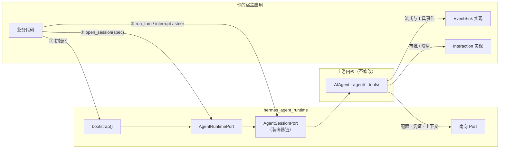
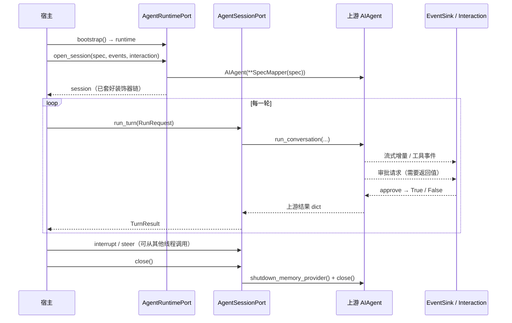

# AgentRuntime 集成指南与接口参考

> 把 Hermes Agent 内核（③ Agent 核心 + ④ 工具能力）当作可嵌入的运行时来使用：如何安装与接入、每个接口怎么调用，以及 9 个可以直接改写的使用案例。

| 项 | 值 |
|---|---|
| 发行包 | `hermes-agent-runtime`（导入名 `hermes_agent_runtime`） |
| 上游基线 | `fc71fb63e5`（NousResearch/hermes-agent v0.21.2） |
| 配套文档 | `agent-runtime-extraction-plan.html`（抽取方案）、`agent-runtime-ports-decorators.html`（Port 与装饰器清单） |
| 状态 | 设计稿：接口尚未实现 |

---

## 0. 阅读须知

> ⚠️ **设计阶段文档**：本文描述的是抽取方案中约定的接口，代码尚未实现。签名以本文为准；实现时如与上游签名冲突，以上游为准，并同步回写本文。

**按角色阅读**

| 角色 | 建议阅读 |
|---|---|
| 宿主开发者（在自己的服务里使用 Agent） | 第 1–4 章、第 6 章案例 1–5 |
| 适配器与扩展作者（接入自有配置、凭证、中间件） | 5.9–5.10、案例 5–7 |
| 维护者（跟随上游升级） | 第 7–8 章 |

**约定**

- **Port** 指 `typing.Protocol` 定义的接口；宿主只依赖 Port，不 import `run_agent`、`agent.*`、`tools.*`。
- **Hosted** 指在完整 hermes-agent 环境中运行（适配器调用上游原实现）；**Standalone** 指只安装本运行时的独立 wheel。
- 所有接口均为**同步**接口；asyncio 宿主请用 `asyncio.to_thread` 调用（见 4.5）。

---

## 1. 概述

### 1.1 AgentRuntime 是什么

AgentRuntime 在上游 hermes-agent 的 Agent 内核外面包了一层稳定接口，上游代码一行不改：

- **北向 Port**：宿主调用运行时的接口，如开会话、发消息、中断、查状态。
- **装饰器**：在不改上游代码的前提下叠加行为，分三层：会话装饰器、执行中间件、依赖转发。
- **南向 Port**：运行时向外索取的能力，如配置、凭证、会话上下文、插件。Hosted 模式由上游提供，Standalone 模式由本包或宿主提供。

宿主因此获得三点保证：只面对一组稳定接口；上游升级不影响宿主代码；同一份宿主代码可以在两种模式之间切换。

### 1.2 两种运行模式

| | Hosted | Standalone |
|---|---|---|
| 安装内容 | 完整 hermes-agent + 本运行时 | 仅本运行时 wheel |
| 南向能力来源 | 调用上游原函数，行为与上游一致 | 本包内置实现或宿主自定义 |
| 可用工具集 | 与上游一致 | 能力子集，由 `capabilities()` 声明 |
| 插件 | 上游插件系统全部可用 | 只运行本运行时注册的中间件 |
| 典型场景 | 自建前端 / 服务，复用现有 `~/.hermes` 配置与技能 | 嵌入业务系统、独立部署、容器化 |

### 1.3 集成架构



### 1.4 环境要求

- **Python**：3.11–3.13，与上游 `requires-python = ">=3.11,<3.14"` 一致。
- **Hosted**：与 hermes-agent 安装在同一个虚拟环境中。
- **Standalone**：wheel 自带运行依赖声明（如 `httpx`、`openai`、`pyyaml`），无需安装 hermes-agent。
- **操作系统**：与上游一致，支持 macOS、Linux、Windows。

---

## 2. 安装与集成方式

### 2.1 Hosted 模式：在 hermes-agent 环境中使用

```sh
# 1. 进入 hermes-agent 所在的虚拟环境（标准安装位置）
source ~/.hermes/hermes-agent/venv/bin/activate

# 2. 以可编辑方式安装运行时（位于仓库自有目录 agent_runtime/）
uv pip install -e ./agent_runtime

# 3. 可选：启用 L2 执行中间件插件（使用自定义中间件或内置追踪时需要）
hermes plugins enable agent-runtime
```

Hosted 模式会直接复用 `~/.hermes/config.yaml`、`.env`、技能与记忆。`RuntimeSpec` 中未指定的项（如模型）按 `config.yaml` 解析。

### 2.2 Standalone 模式：安装独立 wheel

```sh
# 维护者：在同步好上游的仓库中构建（原样复制闭包文件 + 生成影子模块）
python agent_runtime/build/extract.py --out dist/

# 使用者：在业务项目的虚拟环境中安装
pip install dist/hermes_agent_runtime-*.whl
```

Standalone 模式不读取 `~/.hermes`。每个运行时实例都应通过 `bootstrap(hermes_home=...)` 指定独立的状态目录。

### 2.3 初始化：bootstrap 的调用时机

`bootstrap()` 会在上游模块导入前安装依赖转发，因此**必须是进程中第一个触及上游代码的调用**。`hermes_agent_runtime` 自身的公开模块在导入时不会导入上游代码，所以可以放心地一起 import。

```python
# ✅ 正确：入口文件最前面完成初始化
from hermes_agent_runtime import bootstrap

runtime = bootstrap(mode="hosted")

import my_app.routes   # 之后再导入可能间接 import run_agent 的业务模块
```

```python
# ❌ 错误：先导入了上游模块
import run_agent                      # 或 from tools import ... / from agent import ...
from hermes_agent_runtime import bootstrap

runtime = bootstrap(mode="hosted")    # 抛出 BootstrapOrderError
```

> 💡 **同一进程只初始化一次**：重复调用 `bootstrap()` 且参数相同时，返回同一个运行时实例；参数不同则抛出 `BootstrapConflict`。

### 2.4 通过 launcher 接管上游宿主（可选）

如果希望上游自带的 gateway、TUI、cron 也经过运行时的装饰器（例如统一追踪），用 `hermes-rt` 代替 `hermes` 启动。参数完全相同：

```sh
hermes-rt gateway run     # 等价于 hermes gateway run，但先安装转发并启用装饰器
hermes-rt --tui
```

launcher 会把 `run_agent.AIAgent` 替换为子类 `DecoratedAIAgent`。上游宿主代码无需修改，行为保持一致。

### 2.5 如何选择集成方式

| 场景 | 推荐方式 |
|---|---|
| 自建 Web / 桌面前端，复用本机 Hermes 配置与技能 | Hosted + 北向 Port（案例 2、3） |
| 嵌入业务后端，独立部署、配置由业务系统下发 | Standalone + 自定义南向 Port（案例 5） |
| 给现有 Hermes 网关加统一追踪 / 审计 | launcher `hermes-rt` + 自定义装饰器（案例 6） |
| 只想调整模型路由或观测工具耗时 | L2 中间件插件（案例 7） |
| 前端与后端分离部署、只走 HTTP | 不使用本运行时，直接对接 `hermes serve`（见 b-line 决策文档） |

---

## 3. 快速开始

### 3.1 最小示例：一问一答

```python
from hermes_agent_runtime import bootstrap, RuntimeSpec, ToolPolicy, RunRequest

runtime = bootstrap(mode="hosted")

spec = RuntimeSpec(tools=ToolPolicy(enabled_toolsets=["file", "web"]))  # 模型按 config.yaml 默认值
session = runtime.open_session(spec)
try:
    result = session.run_turn(RunRequest(message="读取当前目录的 README.md，用三句话总结"))
    print(result.final_response)
finally:
    session.close()
```

### 3.2 流式输出

```python
from hermes_agent_runtime import bootstrap, RuntimeSpec, RunRequest, EventType

class PrintSink:
    """EventSinkPort 的最小实现：只需要一个 emit 方法。"""

    def emit(self, event):
        if event.type is EventType.STREAM_DELTA:
            print(event.payload["text"], end="", flush=True)
        elif event.type is EventType.TOOL_STARTED:
            print(f"\n[工具] {event.payload['tool_name']} 开始执行")
        elif event.type is EventType.TOOL_COMPLETED:
            print(f"[工具] {event.payload['tool_name']} 完成")

runtime = bootstrap(mode="hosted")
session = runtime.open_session(RuntimeSpec(), events=PrintSink())
try:
    session.run_turn(RunRequest(message="列出 3 个 Python 并发模型并比较"))
finally:
    session.close()
```

### 3.3 读懂运行结果

`run_turn` 返回 `TurnResult`。模型侧的失败（额度不足、内容策略拦截、上下文溢出等）**不会抛异常**，而是体现在结果字段中：

```python
result = session.run_turn(RunRequest(message="..."))
if result.completed:
    render(result.final_response)
elif result.failed:
    show_error(result.error, retry_button=result.retryable)   # retryable 表示重试可能得到不同结果
elif result.partial:
    render(result.final_response, hint="本轮未完整结束，可继续对话")
```

字段完整说明见 5.8。

---

## 4. 核心概念

### 4.1 会话生命周期



- **会话自动维护历史**：每一轮结束后，运行时保存本轮 `TurnResult.messages`，下一轮自动作为对话历史传入。显式提供 `RunRequest.history` 时以它为准，用于从外部存储恢复会话。
- **关闭是必需的**：`close()` 会刷写记忆、释放模型客户端与子进程。请始终放在 `finally` 中调用。

### 4.2 RuntimeSpec：开会话时一次性声明配置

`RuntimeSpec` 是不可变对象，在 `open_session` 时生效，**整个会话期间不变**。这是上游提示缓存机制的要求：对话中途更换工具集、系统提示或记忆，会让缓存前缀失效，成本成倍上升。

需要改变这些配置时，请结束当前会话，用新的 `RuntimeSpec` 开一个新会话。需要保留上下文时，把旧会话的历史通过 `RunRequest.history` 传入。

### 4.3 事件与交互

| | EventSinkPort | InteractionPort |
|---|---|---|
| 方向 | 运行时 → 宿主，单向 | 运行时 → 宿主 → 运行时，需要返回值 |
| 用途 | 流式文本、思考过程、工具进度、状态提示 | 命令审批、向用户澄清、读取终端 / 预览、采集密钥 |
| 未提供时 | 事件被丢弃 | 使用 `DenyAllInteraction`：审批一律拒绝，其余返回「不支持」 |
| 调用线程 | 对话线程内同步调用，实现应尽快返回 | 对话线程内同步调用，会阻塞当前轮次，建议设置超时 |

### 4.4 能力声明与降级

`runtime.capabilities()` 返回当前模式下各项能力是否可用。Standalone 模式缺少某个南向 Port 时，相关工具集会在开会话时自动禁用，模型看不到这些工具，也就不会调用。

```python
caps = runtime.capabilities()
# 例：{'toolset.cronjob': False, 'toolset.messaging': False,
#      'provider.oauth': False, 'plugins.third_party': False, 'maintenance': False}
```

如果在 `ToolPolicy.enabled_toolsets` 中显式请求了不可用的工具集，`open_session` 会抛出 `CapabilityUnavailable`，不会等到运行中途才失败。

### 4.5 线程与并发模型

- `run_turn` **同步阻塞**，直到本轮结束。请在工作线程中调用；asyncio 宿主使用 `await asyncio.to_thread(session.run_turn, request)`。
- `interrupt`、`steer`、`redirect`、`is_interrupted`、`activity` **可以从其他线程调用**，用于在轮次进行中控制它。
- 同一会话的 `run_turn` **串行执行**：默认排队，可配置为直接抛出 `SessionBusy`（见 5.10）。
- 不同会话可以并发。但 Standalone 模式下，部分上游配置通过进程环境变量与进程级全局状态生效，**同一进程内的多会话无法在这些方面隔离**。多租户部署建议一个进程一个活跃会话，或按租户分进程。

### 4.6 必须遵守的上游不变量

1. **提示缓存**：会话内不改系统提示、工具集、记忆。自定义中间件不得改写历史消息与工具定义。
2. **角色严格交替**：不要自行拼接两条相同角色的消息。插话请用 `steer()`，由运行时在合适位置送达。
3. **能力属于会话**：判断「是否在某个前端里」要看 `SessionBinding`，不要读进程环境变量。
4. **状态目录隔离**：Standalone 实例之间不要共享 `hermes_home`。

---

## 5. 接口参考

### 5.1 bootstrap

```python
def bootstrap(
    mode: Literal["hosted", "standalone"] = "hosted",
    *,
    hermes_home: str | os.PathLike | None = None,
    ports: Mapping[str, object] | None = None,
    decorators: Sequence[DecoratorFactory] | None = None,
    middleware: Sequence[tuple[str, Callable[..., Any]]] = (),
    allow_maintenance: bool = False,
    invariant_checks: bool = False,
    adopt_upstream_hosts: bool = False,
    strict_bindings: bool = True,
    tracer: Tracer | None = None,
    metrics: MetricsSink | None = None,
) -> AgentRuntimePort: ...
```

| 参数 | 默认 | 说明 |
|---|---|---|
| `mode` | `"hosted"` | 运行模式 |
| `hermes_home` | `None` | 状态目录。Hosted 默认沿用上游解析结果；Standalone 强烈建议显式指定 |
| `ports` | `None` | 覆盖南向 Port 实现，键见 5.9；Hosted 下通常不需要 |
| `decorators` | `None` | L1 装饰器链，由外到内；`None` 表示 `DEFAULT_DECORATORS` |
| `middleware` | `()` | Standalone 下直接注册的 L2 中间件 `(kind, fn)`；Hosted 下请使用插件方式（案例 7） |
| `allow_maintenance` | `False` | 是否允许 `runtime.maintenance()`，只给长会话宿主开启 |
| `invariant_checks` | `False` | 启用 `CacheInvariantDecorator`，建议在测试与 CI 中开启 |
| `adopt_upstream_hosts` | `False` | 用 `DecoratedAIAgent` 替换 `run_agent.AIAgent`；`hermes-rt` 会自动开启 |
| `strict_bindings` | `True` | 依赖转发与上游不匹配时立即失败；关闭后跳过不匹配项并记录告警 |
| `tracer` / `metrics` | `None` | 追踪与指标后端；`None` 表示不输出 |

**异常**：`BootstrapOrderError`、`BootstrapConflict`、`BindingDrift`。

### 5.2 AgentRuntimePort

```python
class AgentRuntimePort(Protocol):
    def open_session(self, spec: RuntimeSpec, *, events: EventSinkPort | None = None,
                     interaction: InteractionPort | None = None) -> AgentSessionPort: ...
    def maintenance(self, session: AgentSessionPort) -> SessionMaintenancePort: ...
    def capabilities(self) -> Mapping[str, bool]: ...
```

| 方法 | 说明 | 异常 |
|---|---|---|
| `open_session(spec, *, events, interaction)` | 按 `RuntimeSpec` 创建会话，返回已套好装饰器链的会话对象 | `CapabilityUnavailable`、`CredentialError` |
| `maintenance(session)` | 返回该会话的特权维护接口 | `CapabilityUnavailable`（未开启 `allow_maintenance`） |
| `capabilities()` | 当前模式下的能力表 | — |

### 5.3 AgentSessionPort

| 方法 | 返回 | 说明 | 对应上游 |
|---|---|---|---|
| `session_id` | `str` | 会话 ID（属性） | `AIAgent.session_id` |
| `run_turn(request)` | `TurnResult` | 执行一轮对话，阻塞到本轮结束 | `run_conversation` |
| `chat(message)` | `str` | 简化接口，只返回最终文本 | `chat` |
| `interrupt(message=None, *, hard=False, tool_reason=None)` | `bool` | 请求中断当前轮次；`hard=True` 为强制停止 | `interrupt` / `hard_interrupt` |
| `steer(text)` | `bool` | 插话：当前这批工具调用结束后，作为独立 user 消息送达，不中断任务 | `steer` |
| `redirect(text)` | `bool` | 改道：在当前轮次内调整方向，不开启新任务 | `redirect` |
| `clear_interrupt(*, preserve_redirect=False)` | `bool` | 清除中断标记 | `clear_interrupt` |
| `is_interrupted()` | `bool` | 是否处于中断请求中 | `is_interrupted` |
| `activity()` | `Mapping` | 最近活动快照，用于判断是否卡住 | `get_activity_summary` |
| `rate_limit_state()` | 对象或 `None` | 最近一次捕获的限流状态 | `get_rate_limit_state` |
| `credits_state()` | 对象或 `None` | 最近一次捕获的额度状态 | `get_credits_state` |
| `credits_spent_micros()` | `int` 或 `None` | 本会话累计消耗（百万分之一单位） | `get_credits_spent_micros` |
| `reset(*, previous_messages=None, old_session_id=None, carry_over_context=False)` | `None` | 重置会话级计数与压缩状态，用于 `/new` 类操作 | `reset_session_state` |
| `commit_memory(messages=None)` | `None` | 在会话 ID 轮换时刷写记忆，不关闭记忆提供方 | `commit_memory_session` |
| `release_clients()` | `None` | 释放模型客户端与子代理，保留会话工具状态（适合空闲回收） | `release_clients` |
| `close()` | `None` | 关闭会话并释放全部资源，可重复调用 | `shutdown_memory_provider` + `close` |

**steer 与 redirect 的区别**：`steer` 追加一条用户消息，Agent 在处理完当前工具批次后读到它，适合补充要求。`redirect` 在当前轮次内改变方向，适合纠正正在进行的方向。两者都不会开启新任务。

**异常**：`SessionClosed`（会话已关闭）、`SessionBusy`（并发策略为 reject 时）、`UpstreamError`（运行时无法继续的上游异常）。

### 5.4 SessionMaintenancePort

需要 `bootstrap(allow_maintenance=True)`。面向网关、TUI 这类维护长会话的宿主，普通宿主不需要。

| 方法 | 说明 | 对应上游 |
|---|---|---|
| `compress_context(**kwargs)` | 立即压缩上下文（上游允许的唯一一种缓存失效操作） | `_compress_context` |
| `persist()` | 立即持久化会话 | `_persist_session` |
| `flush_to_store()` | 把未写入的消息刷到会话数据库 | `_flush_messages_to_session_db` |
| `invalidate_system_prompt()` | 让系统提示在下次构建时重建，只能在压缩或会话切换时使用 | `_invalidate_system_prompt` |
| `set_end_session_on_close(value)` | 关闭时是否结束会话记录 | `_end_session_on_close` |
| `spawn_background_review(messages)` | 触发后台复盘（技能 / 记忆沉淀） | `_spawn_background_review` |

### 5.5 EventSinkPort 与 RuntimeEvent

```python
class EventSinkPort(Protocol):
    def emit(self, event: RuntimeEvent) -> None: ...

@dataclass(frozen=True)
class RuntimeEvent:
    type: EventType
    session_id: str
    ts: float                      # time.time()
    payload: Mapping[str, Any]     # 标准化字段 + 上游回调的原始参数
```

| `EventType` | 值 | 来源回调 | 保证提供的字段 |
|---|---|---|---|
| `STREAM_DELTA` | `stream.delta` | `stream_delta_callback` | `text` |
| `INTERIM` | `stream.interim` | `interim_assistant_callback` | `text` |
| `THINKING` | `thinking` | `thinking_callback` | `text` |
| `REASONING` | `reasoning` | `reasoning_callback` | `text` |
| `TOOL_STARTED` | `tool.started` | `tool_start_callback` | `tool_name` |
| `TOOL_PROGRESS` | `tool.progress` | `tool_progress_callback` | `tool_name` |
| `TOOL_COMPLETED` | `tool.completed` | `tool_complete_callback` | `tool_name` |
| `TOOL_GENERATING` | `tool.generating` | `tool_gen_callback` | `tool_name` |
| `STEP` | `step` | `step_callback` | — |
| `STATUS` | `status` | `status_callback` | `message` |
| `NOTICE` | `notice` | `notice_callback` | `message` |
| `NOTICE_CLEARED` | `notice.cleared` | `notice_clear_callback` | — |
| `REACTION` | `reaction` | `reaction_callback` | `emoji` |
| `RAW` | `raw` | `event_callback` | `name` |

> 📌 **payload 约定**：「保证提供的字段」由运行时标准化，跨上游版本保持稳定。其余字段是上游回调的原始参数（以参数名为键），会随上游变化，依赖它们时请做好缺省处理。

**实现要求**：`emit` 抛出的异常会被记录并吞掉，不会中断对话；耗时操作（网络发送、写库）请自行放入队列异步处理。

### 5.6 InteractionPort

```python
class InteractionPort(Protocol):
    def clarify(self, question: str, choices: Sequence[str] | None) -> str: ...
    def approve(self, request: Mapping[str, Any]) -> bool: ...
    def read_terminal(self, request: Mapping[str, Any]) -> str: ...
    def capture_secret(self, request: Mapping[str, Any]) -> str | None: ...
```

| 方法 | 触发场景 | 返回约定 |
|---|---|---|
| `clarify` | Agent 需要用户在几个选项中做决定 | 用户的回答文本；不支持时抛 `InteractionUnsupported` |
| `approve` | 命令或文件写入触发审批（是否触发由上游审批策略决定） | `True` 允许 / `False` 拒绝 |
| `read_terminal` | 读取终端、预览窗口等宿主侧内容；`request["kind"]` 取值为 `terminal`、`preview`、`drive_preview`、`window_below` | 读取到的文本；不支持时抛 `InteractionUnsupported` |
| `capture_secret` | 需要用户输入密钥或 sudo 密码 | 密钥文本；`None` 表示用户拒绝提供 |

`from hermes_agent_runtime import DenyAllInteraction` 是默认实现：审批一律拒绝，其余方法表示不支持。自定义实现建议继承它，只覆写需要的方法。

> ⚠️ **不要自行调用上游的进程级回调注册函数**（如 `tools.terminal_tool.set_approval_callback`）。运行时已统一注册，并按会话分发到各自的 `InteractionPort`；自行注册会导致多会话之间审批串线。

### 5.7 RuntimeSpec 与值对象

```python
@dataclass(frozen=True)
class RuntimeSpec:
    route: ModelRoute = ModelRoute()
    tools: ToolPolicy = ToolPolicy()
    session: SessionBinding = SessionBinding()
    prompt: PromptOptions = PromptOptions()
    output: Mapping[str, Any] = field(default_factory=dict)
    capabilities: Mapping[str, bool] | None = None
    passthrough: Mapping[str, Any] = field(default_factory=dict)
```

**ModelRoute（模型路由）**

| 字段 | 类型 | 说明 |
|---|---|---|
| `model` | `str` | 模型名；空字符串表示按配置解析 |
| `provider` | `str` 或 `None` | provider 名，如 `openrouter`、`anthropic`、`custom` |
| `base_url` | `str` 或 `None` | 自定义端点地址 |
| `api_key` | `str` 或 `None` | 显式密钥；建议留空，交给 `CredentialPort` |
| `api_mode` | `str` 或 `None` | `chat_completions`、`codex_responses`、`anthropic_messages`、`bedrock_converse` |
| `fallback_model` | `Mapping` 或 `None` | 主模型失败时的备用模型 |
| `reasoning_config` | `Mapping` 或 `None` | 推理强度等参数 |
| `max_tokens`、`service_tier`、`request_overrides` | — | 透传给模型请求 |
| `routing` | `Mapping` | OpenRouter 类路由偏好：`providers_allowed`、`providers_ignored`、`providers_order`、`provider_sort` 等 |

**ToolPolicy（工具策略）**

| 字段 | 类型 | 说明 |
|---|---|---|
| `enabled_toolsets` | 字符串列表或 `None` | 启用的工具集，如 `terminal`、`file`、`web`、`browser`、`memory`、`skills`、`todo`、`code_execution`、`delegation`、`cronjob` |
| `disabled_toolsets` | 字符串列表或 `None` | 禁用的工具集，优先于启用列表 |
| `max_iterations` | `int` 或 `None` | 单轮最多的模型调用次数，子代理共享 |
| `run_budget_seconds` | `float` 或 `None` | 单轮时间预算 |
| `checkpoints` | `Mapping` | 文件检查点：`enabled`、`max_snapshots`、`max_total_size_mb`、`max_file_size_mb` |

**SessionBinding（会话绑定）**

| 字段 | 说明 |
|---|---|
| `session_id` | 会话 ID；为空时自动生成。相同 ID 会接续会话数据库中的记录 |
| `parent_session_id` | 父会话 ID（压缩轮换、子会话） |
| `platform` | 平台名，需与上游平台名一致（如 `cli`、`telegram`），影响平台提示与默认工具集 |
| `user` | `user_id`、`user_id_alt`、`user_name` |
| `chat` | `chat_id`、`chat_name`、`chat_type`、`thread_id` |
| `gateway_session_key`、`pass_session_id` | 网关路由相关 |

**PromptOptions（提示选项）**

| 字段 | 默认 | 说明 |
|---|---|---|
| `ephemeral_system_prompt` | `None` | 附加的系统提示，会话内固定 |
| `prefill_messages` | `None` | 预置消息 |
| `skip_context_files` | `False` | 不加载工作目录中的上下文文件（如 `AGENTS.md`） |
| `load_soul_identity` | `False` | 加载 `SOUL.md` 人格 |
| `skip_memory` | `False` | 不启用记忆 |
| `skip_background_review` | `False` | 不做后台复盘 |

`passthrough` 用于上游新增、而本运行时尚未收录的构造参数。它会原样传给上游，并在启动时按上游签名校验。

### 5.8 RunRequest 与 TurnResult

```python
@dataclass(frozen=True)
class RunRequest:
    message: str | list[Mapping[str, Any]]            # 文本或多模态内容块
    system_message: str | None = None
    history: Sequence[Mapping[str, Any]] | None = None  # OpenAI 消息格式；为空时使用会话自动维护的历史
    task_id: str | None = None
    extras: Mapping[str, Any] = field(default_factory=dict)  # 透传 run_conversation 其余参数，如 moa_config

@dataclass(frozen=True)
class TurnResult:
    final_response: str | None
    messages: list[dict[str, Any]]
    completed: bool
    failed: bool
    partial: bool
    error: str | None
    failure_reason: str | None
    retryable: bool
    api_calls: int
    compression_deferred: bool
    compressed: bool
    usage: Usage | None
    raw: Mapping[str, Any]
```

| 字段 | 来源 | 说明 |
|---|---|---|
| `final_response` | 上游 `final_response` | 最终回复文本 |
| `messages` | 上游 `messages` | 本轮结束后的完整消息列表 |
| `completed` | 上游 `completed` | 本轮正常结束 |
| `failed` | 上游 `failed` | 本轮失败（额度、策略拦截、不可恢复错误等） |
| `partial` | 上游 `partial` | 本轮未完整结束，但对话可以继续 |
| `error`、`failure_reason` | 上游 `error`、`failure_reason` | 错误描述与分类 |
| `retryable` | 上游 `failure_retryable` | 重试是否可能得到不同结果，用于决定是否显示「重试」 |
| `api_calls` | 上游 `api_calls` | 本轮模型调用次数 |
| `compression_deferred` | 上游 `compression_deferred` | 上下文压缩被暂缓，稍后重试即可 |
| `compressed` | 运行时判定 | 本轮是否发生了上下文压缩 |
| `usage` | 运行时汇总 | `input_tokens`、`output_tokens`、`cost_micros`，可能为 `None` |
| `raw` | 上游完整返回值 | 需要上游其他字段时使用，不保证跨版本稳定 |

### 5.9 南向 Port 与自定义适配器

通过 `bootstrap(ports={...})` 覆盖。未覆盖的 Port 在 Hosted 下调用上游原实现，在 Standalone 下使用内置默认实现。

| 键 | Port | Standalone 默认实现 | 缺席时 |
|---|---|---|---|
| `config` | `ConfigPort` | `YamlConfig(<hermes_home>/config.yaml)`，文件不存在时为空配置 | 必需 |
| `credential` | `CredentialPort` | `EnvCredentials()`：显式密钥 + 环境变量 | 必需 |
| `provider_catalog` | `ProviderCatalogPort` | 随包 provider 档案快照 | 必需 |
| `session_context` | `SessionContextPort` | 内置 ContextVar 实现 | 必需 |
| `profile` | `ProfilePort` | 固定单 profile | 可降级 |
| `host_process` | `HostProcessPort` | psutil 实现 | 可降级 |
| `plugin` | `PluginPort` | 只运行 `bootstrap(middleware=...)` 注册的中间件 | 可降级 |
| `scheduler` | `SchedulerPort` | 不提供 | `cronjob` 工具集禁用 |
| `platform` | `PlatformPort` | 不提供 | 消息投递类工具禁用 |

内置实现位于 `hermes_agent_runtime.adapters.standalone`：`DictConfig`、`YamlConfig`、`EnvCredentials`。

**ConfigPort 示例：从业务配置中心读取**

```python
import copy
from pathlib import Path
from hermes_agent_runtime.errors import CapabilityUnavailable

class RemoteConfig:
    """实现 ConfigPort：配置由业务配置中心下发，结构与上游 config.yaml 相同。"""

    def __init__(self, client):
        self._client = client
        self._cache = client.fetch("agent-runtime")      # 启动时拉取一次

    def read(self):
        return self._cache                               # 只读视图：热路径，调用方不得修改

    def read_mutable(self):
        return copy.deepcopy(self._cache)

    def read_raw(self):
        return copy.deepcopy(self._cache)

    def env(self, name, default=""):
        return self._client.secret(name) or default

    def path(self):
        return Path("/dev/null")

    def save(self, cfg, **kw):
        raise CapabilityUnavailable("config.save 在托管配置下不可用")
```

> ⚠️ **`read()` 位于热路径**：上游每轮会多次读取配置。实现中不要做网络请求或深拷贝，请在内存中缓存。

### 5.10 装饰器扩展接口

**L1 会话装饰器**：继承 `SessionDecorator`，只覆写关心的方法，未覆写的方法自动委托给内层。

```python
from hermes_agent_runtime.decorators import (
    SessionDecorator, DEFAULT_DECORATORS,
    CapabilityGateDecorator, ConcurrencyGuardDecorator, ErrorMappingDecorator,
    TracingDecorator, MetricsDecorator, CacheInvariantDecorator,
)

# 默认链（由外到内）
DEFAULT_DECORATORS = (
    CapabilityGateDecorator, ConcurrencyGuardDecorator, ErrorMappingDecorator,
    TracingDecorator, MetricsDecorator,
)
```

`decorators` 参数接受「以内层会话为参数、返回会话对象」的工厂。需要额外参数时用 `functools.partial`：

```python
from functools import partial

runtime = bootstrap(
    decorators=[partial(ConcurrencyGuardDecorator, policy="reject"),   # 并发时直接抛 SessionBusy
                *DEFAULT_DECORATORS[2:]],
)
```

**L2 执行中间件**：遵循上游 `hermes.middleware.v1` 契约。

| kind | 回调收到的主要参数 | 返回 |
|---|---|---|
| `llm_request` | `request`、`original_request`、`session_id`、`provider`、`model`、`api_mode` | `{"request": {...}}` |
| `llm_execution` | `request`、`original_request`、`next_call` | 模型响应（通常是 `next_call(request)` 的结果） |
| `tool_request` | `tool_name`、`args`、`original_args`、`tool_call_id` | `{"args": {...}}` |
| `tool_execution` | `tool_name`、`args`、`original_args`、`next_call` | 工具结果（通常是 `next_call(args)` 的结果） |

- 请求类中间件请用 `@guarded_request_middleware` 装饰，自动拒绝改写 `messages`、`input`、`tools`、`system` 的返回值。
- 上游约定失败放行：中间件抛异常时记录警告并跳过，不能作为唯一的安全防线。

### 5.11 异常类型

全部位于 `hermes_agent_runtime.errors`，继承自 `AgentRuntimeError`。

| 异常 | 何时抛出 | 处理建议 |
|---|---|---|
| `BootstrapOrderError` | `bootstrap` 之前已导入上游模块 | 把 `bootstrap` 移到入口最前面，或改用 `hermes-rt` |
| `BootstrapConflict` | 以不同参数重复调用 `bootstrap` | 进程内统一初始化一次 |
| `BindingDrift` | 上游符号不存在或签名不兼容（同步上游后常见） | 运行契约守卫，更新绑定清单 |
| `CapabilityUnavailable` | 请求了当前模式不提供的能力或工具集 | 调整 `ToolPolicy`，或提供对应南向 Port |
| `CredentialError` | 开会话时无法解析模型凭证 | 检查 `ModelRoute` 与 `CredentialPort` |
| `SessionBusy` | 同一会话已有轮次在执行（并发策略为 reject） | 排队或提示用户稍后 |
| `SessionClosed` | 对已关闭的会话调用方法 | 重新 `open_session` |
| `InteractionUnsupported` | 宿主未实现某种交互 | 由运行时转换为「宿主不支持」反馈给模型，一般无需处理 |
| `InvariantViolation` | 会话内系统提示或工具集发生变化（仅 `invariant_checks=True`） | 排查自定义中间件或配置变更 |
| `UpstreamError` | 其他导致运行时无法继续的上游异常 | 查看 `__cause__` 中的原始异常 |

> 📌 **失败优先走结果而非异常**：额度不足、内容策略拦截、上下文溢出等模型侧失败，由 `TurnResult.failed` 与 `failure_reason` 表示，不抛异常。

---

## 6. 使用案例

### 6.1 案例 1：命令行问答工具（Hosted）

复用本机 Hermes 配置，做一个带流式输出的多轮命令行助手。

```python
#!/usr/bin/env python3
"""ask.py —— 基于 AgentRuntime 的多轮命令行助手。"""
from hermes_agent_runtime import bootstrap, RuntimeSpec, ToolPolicy, PromptOptions, RunRequest, EventType

runtime = bootstrap(mode="hosted")


class ConsoleSink:
    def emit(self, event):
        if event.type is EventType.STREAM_DELTA:
            print(event.payload["text"], end="", flush=True)
        elif event.type is EventType.TOOL_STARTED:
            print(f"\n  ⚙ {event.payload['tool_name']}", flush=True)


def main():
    spec = RuntimeSpec(
        tools=ToolPolicy(enabled_toolsets=["file", "web", "todo"], max_iterations=30),
        prompt=PromptOptions(skip_background_review=True),
    )
    session = runtime.open_session(spec, events=ConsoleSink())
    try:
        while True:
            try:
                text = input("\n\n你> ").strip()
            except EOFError:
                break
            if text in {"exit", "quit"}:
                break
            if not text:
                continue
            result = session.run_turn(RunRequest(message=text))   # 历史由会话自动维护
            if result.failed:
                print(f"\n[失败] {result.error}" + ("（可重试）" if result.retryable else ""))
    except KeyboardInterrupt:
        session.interrupt("用户按下 Ctrl+C")
    finally:
        session.close()


if __name__ == "__main__":
    main()
```

### 6.2 案例 2：FastAPI + WebSocket 流式聊天服务

一个连接对应一个会话：前端发送文本、停止、插话三种消息，服务端推送流式事件与轮次结果。

```python
"""server.py —— uvicorn server:app --port 8080"""
import asyncio

from fastapi import FastAPI, WebSocket, WebSocketDisconnect
from hermes_agent_runtime import bootstrap, RuntimeSpec, ToolPolicy, SessionBinding, RunRequest

runtime = bootstrap(mode="hosted")   # 在导入其他业务模块之前完成
app = FastAPI()

JSON_SCALARS = (str, int, float, bool, type(None))


class QueueSink:
    """在对话线程中被调用：只做线程安全的入队，立即返回。"""

    def __init__(self, loop, queue):
        self.loop, self.queue = loop, queue

    def emit(self, event):
        payload = {k: v for k, v in event.payload.items() if isinstance(v, JSON_SCALARS)}
        self.loop.call_soon_threadsafe(self.queue.put_nowait, {"type": event.type.value, "payload": payload})


@app.websocket("/chat/{session_id}")
async def chat(ws: WebSocket, session_id: str):
    await ws.accept()
    loop, queue = asyncio.get_running_loop(), asyncio.Queue()
    spec = RuntimeSpec(
        session=SessionBinding(session_id=session_id),
        tools=ToolPolicy(enabled_toolsets=["web", "file", "todo"]),
    )
    session = await asyncio.to_thread(runtime.open_session, spec, events=QueueSink(loop, queue))

    async def pump_events():
        while True:
            await ws.send_json(await queue.get())

    async def run_one(text):
        result = await asyncio.to_thread(session.run_turn, RunRequest(message=text))
        await ws.send_json({"type": "turn.done", "final": result.final_response,
                            "failed": result.failed, "retryable": result.retryable})

    pump = asyncio.create_task(pump_events())
    turn = None
    try:
        while True:
            msg = await ws.receive_json()
            action = msg.get("action", "send")
            if action == "stop":
                session.interrupt("用户点击了停止")
            elif action == "steer":
                session.steer(msg["text"])                       # 进行中的任务补充要求
            elif turn is None or turn.done():
                turn = asyncio.create_task(run_one(msg["text"]))
            else:
                await ws.send_json({"type": "busy"})
    except WebSocketDisconnect:
        session.interrupt("连接断开")
    finally:
        pump.cancel()
        if turn:
            await asyncio.gather(turn, return_exceptions=True)
        await asyncio.to_thread(session.close)
```

> 💡 **为什么用 `asyncio.to_thread`**：`run_turn` 是同步阻塞调用，直接在事件循环中调用会卡住整个服务。`interrupt`、`steer` 耗时极短，可以直接调用。

### 6.3 案例 3：长任务的中断与插话

在工作线程中执行长任务，主线程根据用户输入插话或取消。

```python
import threading

from hermes_agent_runtime import bootstrap, RuntimeSpec, ToolPolicy, RunRequest

runtime = bootstrap(mode="hosted")
session = runtime.open_session(RuntimeSpec(tools=ToolPolicy(enabled_toolsets=["file", "terminal", "todo"])))

outcome = {}
worker = threading.Thread(
    target=lambda: outcome.update(result=session.run_turn(
        RunRequest(message="扫描 src/ 目录，把所有 TODO 注释整理成按模块分组的表格"))),
    daemon=True,
)
worker.start()

try:
    while worker.is_alive():
        cmd = input("（输入补充要求，/stop 取消，回车跳过）> ").strip()
        if cmd == "/stop":
            session.interrupt("用户取消")
        elif cmd:
            session.steer(cmd)            # 例如「只统计 .py 文件」
        worker.join(timeout=0.5)
finally:
    worker.join()
    session.close()

result = outcome["result"]
print(result.final_response if result.completed else f"未完成：{result.error}")
```

### 6.4 案例 4：工具调用的人工审批

危险命令需要人工确认。继承 `DenyAllInteraction`，只实现审批与澄清。

```python
from hermes_agent_runtime import bootstrap, RuntimeSpec, ToolPolicy, RunRequest, DenyAllInteraction


class ConsoleApproval(DenyAllInteraction):
    def approve(self, request):
        print("\n⚠️  Agent 请求执行以下操作：")
        for key, value in request.items():
            print(f"    {key}: {value}")
        return input("允许执行？[y/N] ").strip().lower() == "y"

    def clarify(self, question, choices):
        print(f"\n❓ {question}")
        for i, choice in enumerate(choices or [], 1):
            print(f"    {i}. {choice}")
        answer = input("请选择或直接输入：").strip()
        return choices[int(answer) - 1] if answer.isdigit() and choices else answer


runtime = bootstrap(mode="hosted")
session = runtime.open_session(
    RuntimeSpec(tools=ToolPolicy(enabled_toolsets=["terminal", "file"])),
    interaction=ConsoleApproval(),
)
try:
    session.run_turn(RunRequest(message="清理当前目录下超过 30 天的 *.log 文件"))
finally:
    session.close()
```

> 📌 **哪些操作会触发审批**由上游审批策略决定（`hermes_cli` 的审批模式配置），`InteractionPort` 只负责呈现并返回决定。Web 服务中请把审批请求推给前端，并设置超时，超时按拒绝处理，避免对话线程无限等待。

### 6.5 案例 5：Standalone 嵌入业务服务

订单客服后端：不依赖本机 Hermes 安装，配置来自业务配置文件，模型走内部网关，工具只开放文件与待办。

```python
from hermes_agent_runtime import (
    bootstrap, RuntimeSpec, ModelRoute, ToolPolicy, PromptOptions, SessionBinding, RunRequest,
)
from hermes_agent_runtime.adapters.standalone import YamlConfig, EnvCredentials

runtime = bootstrap(
    mode="standalone",
    hermes_home="/var/lib/order-bot/agent",                 # 每个实例独立的状态目录
    ports={
        "config": YamlConfig("/etc/order-bot/agent-config.yaml"),   # 结构与上游 config.yaml 相同
        "credential": EnvCredentials(api_key_env="ORDER_BOT_LLM_KEY"),
    },
)

caps = runtime.capabilities()
assert not caps["toolset.cronjob"]                          # 未提供 SchedulerPort，定时任务不可用

SPEC = RuntimeSpec(
    route=ModelRoute(
        provider="custom",
        base_url="https://llm-gateway.internal.example.com/v1",
        api_mode="chat_completions",
        model="qwen3-72b-instruct",
    ),
    tools=ToolPolicy(enabled_toolsets=["file", "todo"], max_iterations=15, run_budget_seconds=120),
    prompt=PromptOptions(
        ephemeral_system_prompt="你是订单客服助手。只回答与订单、物流、退款相关的问题。",
        skip_context_files=True,
        skip_memory=True,
        skip_background_review=True,
    ),
)


def answer(customer_id: str, conversation_id: str, text: str, history=None) -> str:
    spec = RuntimeSpec(
        route=SPEC.route, tools=SPEC.tools, prompt=SPEC.prompt,
        session=SessionBinding(session_id=conversation_id, user={"user_id": customer_id}),
    )
    session = runtime.open_session(spec)
    try:
        result = session.run_turn(RunRequest(message=text, history=history))   # 历史从业务库恢复
        return result.final_response if result.completed else "抱歉，暂时无法处理，请稍后再试。"
    finally:
        session.close()
```

> ⚠️ **多租户部署**：Standalone 模式下，同一进程内的多会话无法隔离环境变量级别的配置（见 4.5）。按租户分进程部署，或保证一个进程同一时刻只有一个活跃会话。

### 6.6 案例 6：自定义 L1 装饰器——审计日志

记录每一轮的输入摘要、结果状态与耗时，写入 JSON Lines 审计文件。也可以配合 `hermes-rt` 给上游网关加审计。

```python
import json
import threading
import time
from functools import partial

from hermes_agent_runtime import bootstrap
from hermes_agent_runtime.decorators import SessionDecorator, DEFAULT_DECORATORS


class AuditDecorator(SessionDecorator):
    """只覆写 run_turn 与 interrupt，其余方法自动委托给内层会话。"""

    def __init__(self, inner, *, path):
        super().__init__(inner)
        self._path = path
        self._lock = threading.Lock()

    def _write(self, record):
        with self._lock, open(self._path, "a", encoding="utf-8") as f:
            f.write(json.dumps(record, ensure_ascii=False) + "\n")

    def run_turn(self, request):
        started = time.monotonic()
        result = self._inner.run_turn(request)
        self._write({
            "event": "turn",
            "session_id": self._inner.session_id,
            "input": str(request.message)[:200],
            "completed": result.completed,
            "failed": result.failed,
            "failure_reason": result.failure_reason,
            "api_calls": result.api_calls,
            "elapsed_ms": int((time.monotonic() - started) * 1000),
        })
        return result

    def interrupt(self, message=None, **kw):
        self._write({"event": "interrupt", "session_id": self._inner.session_id, "message": message})
        return self._inner.interrupt(message, **kw)


runtime = bootstrap(
    mode="hosted",
    # 默认链之后追加：审计装饰器位于最内层，记录的是真实执行结果
    decorators=[*DEFAULT_DECORATORS, partial(AuditDecorator, path="/var/log/agent/audit.jsonl")],
)
```

### 6.7 案例 7：自定义 L2 中间件——模型路由与工具耗时

**第一步：编写中间件**

```python
# my_agent_policy/plugin.py
import logging
import time

from hermes_agent_runtime.decorators import guarded_request_middleware

log = logging.getLogger("my_agent_policy")


@guarded_request_middleware
def route_batch_sessions(**kw):
    """批处理会话固定走低成本模型。同一会话内始终一致，不破坏提示缓存。"""
    request = kw["request"]
    if str(kw.get("session_id", "")).startswith("batch-"):
        return {"request": {**request, "model": "cheap-fast-model"},
                "source": "my_agent_policy", "reason": "batch session"}
    return {"request": request}


def time_tools(**kw):
    """包住真实的工具执行，记录耗时；必须调用 next_call 才会继续执行。"""
    started = time.perf_counter()
    try:
        return kw["next_call"](kw["args"])
    finally:
        log.info("tool=%s elapsed_ms=%.1f", kw.get("tool_name"), (time.perf_counter() - started) * 1000)


def register(ctx):
    ctx.register_middleware("llm_request", route_batch_sessions)
    ctx.register_middleware("tool_execution", time_tools)
```

**第二步 A：Hosted 模式以插件形式发布**

```toml
# my_agent_policy/pyproject.toml
[project]
name = "my-agent-policy"
version = "0.1.0"

[project.entry-points."hermes_agent.plugins"]
my-agent-policy = "my_agent_policy.plugin"
```

```sh
uv pip install -e ./my_agent_policy
hermes plugins enable my-agent-policy
```

**第二步 B：Standalone 模式直接注册**

```python
from hermes_agent_runtime import bootstrap
from my_agent_policy.plugin import route_batch_sessions, time_tools

runtime = bootstrap(
    mode="standalone",
    hermes_home="/var/lib/my-app/agent",
    middleware=[("llm_request", route_batch_sessions), ("tool_execution", time_tools)],
)
```

### 6.8 案例 8：长会话宿主的上下文维护

适用于常驻会话的网关类宿主：定期压缩上下文、空闲时释放资源、处理「开启新话题」。

```python
from hermes_agent_runtime import bootstrap, RuntimeSpec, SessionBinding, RunRequest

runtime = bootstrap(mode="hosted", allow_maintenance=True)
sessions = {}   # chat_id -> (session, maintenance)


def get_session(chat_id):
    if chat_id not in sessions:
        session = runtime.open_session(RuntimeSpec(session=SessionBinding(session_id=f"chat-{chat_id}")))
        sessions[chat_id] = (session, runtime.maintenance(session))
    return sessions[chat_id]


def on_message(chat_id, text):
    session, maint = get_session(chat_id)
    result = session.run_turn(RunRequest(message=text))
    if result.compression_deferred:
        log.info("压缩被暂缓，下一轮会自动重试")
    elif result.usage and result.usage.input_tokens > 150_000:
        maint.compress_context()                 # 主动压缩：上游允许的唯一缓存失效操作
    return result.final_response


def on_idle(chat_id):
    session, maint = sessions[chat_id]
    maint.flush_to_store()                       # 确保消息已落库
    session.release_clients()                    # 释放模型客户端，保留会话状态


def on_new_topic(chat_id):
    session, _ = sessions.pop(chat_id)
    session.commit_memory()                      # 刷写记忆
    session.close()                              # 新话题开新会话，而不是在旧会话里改配置
```

### 6.9 案例 9：用本地假模型做端到端测试

不访问真实模型：用一个兼容 OpenAI 协议的本地桩服务，验证运行时与上游的真实调用链。所有模块都真实导入，状态写入临时 `HERMES_HOME`。

```python
# tests/test_runtime_e2e.py
import json
import threading
from http.server import BaseHTTPRequestHandler, HTTPServer

import pytest
from hermes_agent_runtime import (
    bootstrap, RuntimeSpec, ModelRoute, ToolPolicy, PromptOptions, RunRequest,
)


class FakeOpenAI(BaseHTTPRequestHandler):
    """固定回复 "pong"；同时支持普通响应与 SSE 流式响应。"""

    def do_POST(self):
        body = json.loads(self.rfile.read(int(self.headers["Content-Length"])))
        if body.get("stream"):
            self.send_response(200)
            self.send_header("Content-Type", "text/event-stream")
            self.end_headers()
            for delta in ({"role": "assistant", "content": "po"}, {"content": "ng"}):
                chunk = {"id": "c1", "object": "chat.completion.chunk", "model": body["model"],
                         "choices": [{"index": 0, "delta": delta, "finish_reason": None}]}
                self.wfile.write(f"data: {json.dumps(chunk)}\n\n".encode())
            done = {"id": "c1", "object": "chat.completion.chunk", "model": body["model"],
                    "choices": [{"index": 0, "delta": {}, "finish_reason": "stop"}],
                    "usage": {"prompt_tokens": 12, "completion_tokens": 2, "total_tokens": 14}}
            self.wfile.write(f"data: {json.dumps(done)}\n\ndata: [DONE]\n\n".encode())
            return
        reply = {"id": "c1", "object": "chat.completion", "created": 0, "model": body["model"],
                 "choices": [{"index": 0, "finish_reason": "stop",
                              "message": {"role": "assistant", "content": "pong"}}],
                 "usage": {"prompt_tokens": 12, "completion_tokens": 2, "total_tokens": 14}}
        data = json.dumps(reply).encode()
        self.send_response(200)
        self.send_header("Content-Type", "application/json")
        self.send_header("Content-Length", str(len(data)))
        self.end_headers()
        self.wfile.write(data)

    def log_message(self, *args):
        pass


@pytest.fixture(scope="session")
def fake_llm():
    server = HTTPServer(("127.0.0.1", 0), FakeOpenAI)
    threading.Thread(target=server.serve_forever, daemon=True).start()
    yield f"http://127.0.0.1:{server.server_port}/v1"
    server.shutdown()


@pytest.fixture(scope="session")
def runtime(tmp_path_factory):
    # 进程内只初始化一次；打开不变量校验
    return bootstrap(mode="standalone", hermes_home=tmp_path_factory.mktemp("hermes_home"),
                     invariant_checks=True)


def test_single_turn_roundtrip(runtime, fake_llm):
    spec = RuntimeSpec(
        route=ModelRoute(provider="custom", base_url=fake_llm, api_key="test",
                         api_mode="chat_completions", model="fake-model"),
        tools=ToolPolicy(enabled_toolsets=[]),
        prompt=PromptOptions(skip_context_files=True, skip_memory=True, skip_background_review=True),
    )
    session = runtime.open_session(spec)
    try:
        result = session.run_turn(RunRequest(message="ping"))
    finally:
        session.close()

    assert result.completed and not result.failed
    assert result.final_response == "pong"
    roles = [m["role"] for m in result.messages if m["role"] != "system"]
    assert all(a != b for a, b in zip(roles, roles[1:])), "角色必须严格交替"
```

---

## 7. 错误处理与排障

| 现象 | 可能原因 | 解决办法 |
|---|---|---|
| 启动时抛 `BootstrapOrderError` | 某个模块在 `bootstrap` 之前导入了 `run_agent`、`agent` 或 `tools` | 把 `bootstrap` 放到入口文件最前面；无法控制导入顺序时使用 `hermes-rt` |
| 同步上游后启动抛 `BindingDrift` | 上游改名或移动了被转发的符号 | 运行契约守卫定位变化，更新绑定清单；临时可用 `strict_bindings=False` 降级 |
| `open_session` 抛 `CapabilityUnavailable: toolset.cronjob` | Standalone 未提供 `SchedulerPort`，却启用了 `cronjob` 工具集 | 从 `enabled_toolsets` 移除，或通过 `ports={"scheduler": ...}` 提供实现 |
| `open_session` 抛 `CredentialError` | 未配置对应 provider 的密钥 | Hosted 检查 `~/.hermes/.env`；Standalone 检查 `EnvCredentials` 的环境变量 |
| 收不到流式事件 | 未传 `events`，或 `emit` 内部抛异常（异常会被记录并吞掉） | 检查日志中的 EventSink 告警，确认 `emit` 不抛异常 |
| 自定义中间件不生效（Hosted） | 插件未启用 | 执行 `hermes plugins enable <插件名>`，并确认安装在同一虚拟环境 |
| 同一会话的调用费用突然升高 | 会话中途改变了系统提示、工具集或记忆，提示缓存失效 | 用 `invariant_checks=True` 复现；需要变更配置时开新会话 |
| 审批弹到了别的会话 | 宿主自行调用了上游进程级回调注册函数 | 删除这些调用，统一通过 `InteractionPort` 处理 |
| `run_turn` 长时间不返回 | `InteractionPort` 在等待人工输入且没有超时；或模型长时间无响应 | 为交互设置超时；用 `session.activity()` 判断卡在哪一步；必要时 `interrupt(hard=True)` |
| `run_turn` 抛 `SessionBusy` | 同一会话并发调用，且并发策略为 reject | 宿主侧排队，或改回默认的排队策略 |
| 结果 `failed=True` 且 `retryable=False` | 额度不足、内容策略拦截等确定性失败 | 展示 `error` 给用户，不要自动重试 |

---

## 8. 版本兼容与升级

### 8.1 接口稳定性等级

| 等级 | 接口 | 承诺 |
|---|---|---|
| **稳定** | `bootstrap`、`AgentRuntimePort`、`AgentSessionPort`、`EventSinkPort`（含标准化字段）、`InteractionPort`、`RuntimeSpec` 值对象、`RunRequest`、`TurnResult`（`raw` 除外）、异常类型 | 次版本内只增不删；删除前至少保留一个次版本并给出弃用警告 |
| **受控** | 南向 Port、`SessionDecorator`、中间件契约 | 跟随上游演进；变化在发行说明中列出迁移方法 |
| **实验** | `SessionMaintenancePort`、`DecoratedAIAgent` / `hermes-rt` | 可能随上游内部实现调整 |
| **不保证** | `RuntimeSpec.passthrough`、`TurnResult.raw`、`RuntimeEvent.payload` 中的非标准化字段 | 原样反映上游，随上游变化 |

### 8.2 跟随上游升级

```sh
git checkout main && git pull                 # main 是上游纯镜像，永远快进
git checkout local/agent-runtime
git rebase main                               # 自有文件只在 agent_runtime/ 与 contract/，不会冲突
python -m agent_runtime.guard --all           # 契约守卫：构造参数、绑定符号、顶层导入、中间件版本、闭包漂移
python agent_runtime/build/extract.py --check # 闭包文件变化检查
```

守卫失败时，修复只发生在 `agent_runtime/` 内：更新绑定清单、`SpecMapper` 或适配器，**不修改上游文件**。

### 8.3 版本号约定

- 运行时版本格式：`<运行时主.次.修>+hermes.<上游版本>`，例如 `0.3.1+hermes.0.21.2`。
- 上游升级只引起「受控」或「不保证」级别的变化时，提升修订号；稳定级接口新增能力时，提升次版本号。

---

## 附录 A　接口速查

| 名称 | 类型 | 位置 | 章节 |
|---|---|---|---|
| `bootstrap` | 函数 | `hermes_agent_runtime` | 5.1 |
| `AgentRuntimePort` | 北向 Port | `hermes_agent_runtime.ports` | 5.2 |
| `AgentSessionPort` | 北向 Port | `hermes_agent_runtime.ports` | 5.3 |
| `SessionMaintenancePort` | 北向 Port | `hermes_agent_runtime.ports` | 5.4 |
| `EventSinkPort` / `RuntimeEvent` / `EventType` | 北向 Port / 数据类 | `hermes_agent_runtime` | 5.5 |
| `InteractionPort` / `DenyAllInteraction` | 北向 Port / 默认实现 | `hermes_agent_runtime` | 5.6 |
| `RuntimeSpec` / `ModelRoute` / `ToolPolicy` / `SessionBinding` / `PromptOptions` | 值对象 | `hermes_agent_runtime` | 5.7 |
| `RunRequest` / `TurnResult` / `Usage` | 数据类 | `hermes_agent_runtime` | 5.8 |
| `ConfigPort` 等 9 个南向 Port | 南向 Port | `hermes_agent_runtime.ports` | 5.9 |
| `DictConfig` / `YamlConfig` / `EnvCredentials` | Standalone 默认实现 | `hermes_agent_runtime.adapters.standalone` | 5.9 |
| `SessionDecorator` / `DEFAULT_DECORATORS` / 各 L1 装饰器 | 装饰器 | `hermes_agent_runtime.decorators` | 5.10 |
| `guarded_request_middleware` | 中间件装饰器 | `hermes_agent_runtime.decorators` | 5.10 |
| `AgentRuntimeError` 及子类 | 异常 | `hermes_agent_runtime.errors` | 5.11 |
| `hermes-rt` | 命令行 launcher | 安装后提供 | 2.4 |
